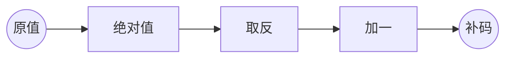
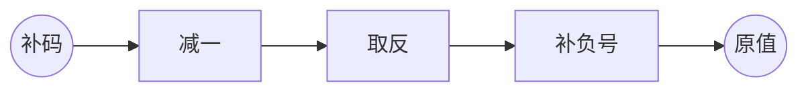

# 数据溢出

## 一道面试题

找出以下代码问题

```
#define MAX 255

int main (void) {
    unsigned char A[MAX], i;

    for (i=0; i<=MAX; i++)
        A[i] = i;
}
```

## 整形的取值范围

**unsigned char**

```
76543210  位编号

11111111  255  2^8-1
11111110  254
...
00000001  1
00000000  0
```

`unsigned char`类型数值范围是 0 ~ 2^8-1(0~255)


**unsigned char的数据溢出**

```
向上溢出
   1111 1111 + 1    进位溢出
 1 0000 0000        最高为舍弃，结果为0000 0000

向下溢出
  0000 0000 - 1   借位溢出，相当于1 0000 0000 - 1
  1111 1111       结果为1111 1111
```

- 最大值`1111 1111`向上溢出得到最小值`0000 0000`
- 最小值`0000 0000`向下溢出得到最大值`1111 1111`

**题目存在的问题**

`unsigned char`类型最大值为255，i的值不会超过255，循环永远不会结束。


**char**

```
76543210

01111111  127
01111110  126
...
00000010  2
00000001  1

00000000  0    -----------------------

11111111  -1   全1代表-1
11111110  -2
11111101  -3
...
10000001  -127
10000000  -128

```

- 最高位为符号位
- `char`的数值范围：-2^7 ~ 2^7-1，即-128 ~ 127
- 全 1 代表 -1


**char的数据溢出**

```
向上溢出
  0111 1111 + 1
  1000 0000      -128，同样得到最小数

向下溢出
  1000 0000 - 1
  0111 1111       127，同样得到最大值
```

- 最小变最大
- 最大变最小

**unsigned int 和 int**

```
unsigned int 数值范围
  11111111 11111111 11111111 11111111  2^32-1
  ....
  00000000 00000000 00000000 00000000  0

int 的数值范围
  01111111 11111111 11111111 11111111  2^31
  ....
  00000000 00000000 00000000 00000000  0  --------------------------------
  11111111 11111111 11111111 11111111  -1            全1代表-1
  ...
  10000000 00000000 00000000 00000000  -2^31
```

数据溢出原理同上。


## 补码

计算机存储整形数据时以补码的形式存储的：

- 正数的补码为自身
- 负数的补码为自身绝对值取反加1

**-1的补码**

```
00000001  |-1|
11111110  ~
       1  +
11111111  -1的补码为11111111
```

**-2的补码**

```
00000010  |-2|
11111101  ~
       1  +
11111110  -2的补码为11111110
```

**运算过程**





## 补码的好处

1. 同一个数的正数数和负数相加为0
2. 可以变减法为加法，如计算机计算5-4时，可以转换为5+(-4)来实现

```
00000101   5
11111011  -5

二者相加为0
```

## 一个例子

请问a，b各自代表的十进制数时多少？

```
#include <stdio.h>

int main(void) {
    int a = -20;
    unsigned int b = a;

    printf("%d, %u\n", a, b);
}
```

1. 计算机存放-20时，存放的是-20的补码（20取反 加1） `11111111 11111111 11111111 11101100`

2. b初始化的时候，会将a中的数据`11111111 11111111 11111111 11101100`复制过去，但是`b`的类型为`unsigned int`，因此会以`unsigned int`去解释这个数。此时，最高位的`1`不是符号，而是数值的一部分，因此`b`是一个很大的数4294967276
