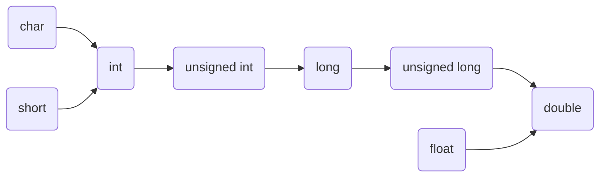

# 自动类型转换

## 一道面试题

```
#include <stdio.h>

int main (void) {
    unsigned int a = 100;
    while (a > -1) {
        --a;
    }
    printf("%d\n", a);
    return 0;
}
```

printf打印结果是多少？

A -1， B 100 ， C 0， D 死循环

答案：B
`a > -1`条件不成立，根本不会进入循环

## 强制类型转换

**隐式强制转换**

- 使用`=`等号来初始化和赋值时，当左值类型与右值类型不一致时
- 进行函数传参，当实参与形参类型不一致时
- 函数返回“返回值”，当返回值与返回类型不一致时

*需要强制转换的时候，尽量使用显式强制转换*

**显式强制转换**

- `(int)25.05`

## 自动类型强制转换

在进行如下运算时，“运算数的类型”可能不相同，进行运算之前，必须转换为相同类型才能进行运算。

- 算术
- 关系
- 位运算


**自动类型转换规则**

- 低类型向高类型转换，有符号向无符号转换
- 当有`char`、`short`参与运算时，会先自动转换为`int`，然后参与运算
- 当有浮点参与运算时，所有类型都会转换为`double`，然后参与运算

**转换链**



*一般系统中long和int大小相同*

## 一些例子

1. 例子1

```
char a = 20;
short b = 30;
char c;

c =  a + b;
```

- `a`从`char`转`int`，`b`从short转`int`，`a+b`结果为`int`。
- 赋值时，`int`隐式转换为`char`，然后赋给`c`。

2. 例子2

```
char a = 'a';
short i = 1;
long k = 20;
float f = 23.1;
int result;

result = (a / i + k) + (f * a - i);
```

- `a/i`：`a`和`i`都转为`int`，结果为`int`
- `a/i+k`：`a/i`的结果为`int`，`k`为`long`，因此`a/i`的结果转换为`long`在与`k`相加，结果为`long`
- `f*a`：`f`为`float`，因此`f`和`a`都转换为`double`，然后相乘，结果为`double`
- `f*a-i`：`i`转为`double`，然后相减，结果为`double`
- ``(a/i+k)+(f*a-i)``：左括号结果为`long`，右括号结果为`double`，所以左括号结果转`double`，然后相加，结果为`double`
- 最终结果隐式强制转换为`int`，赋值给`result`

3. 例子3

```
char a = 'a';
short i = 1;
unsigned int d = 20;
long k = 20;
unsigned long int f = 304;
int result;

result = a * i * d + k + f + 12.3;
```

- `a*i`：`a`和`i`都转为`int`，然后相乘，结果为`int`
- `a*i*d`：`a*i`的结果转`unsigned int`，然后于`d`相乘，结果为`unsigned int`
- `a*i*d+k`：因为`k`为`long`，所以`a*i*d`的结果转为`long`，然后相加，结果为`long`
- `a*i*d+k+f`：因为`f`为`unsigned long int`，所以`a*i*d+k+f`的结果转换为`unsigned long int`，然后相加，结果为`unsigned long int`
- `a*i*d+k+f+12.3`：常数`12.3`类型为`double`，所以`a*i*d+k+f`转换为`double`，然后在于`12.3`相加，结果为`double`
- 赋值时，结果隐式转换为`char`

4. 例子4

```
char a = 10;
short b = 20;

if (a > b) {
    ...
}
```

- `a`和`b`先转为`int`，然后再比较


5. 例子5

```
unsigned int a = 100;

while (a > -1) {
    --a;
}

printf("%d\n", a);

```
- `a`为`unsigned int`，所以`<`两端先要统一成`unsigned int`
- `-1`的补码为32位全`1`，用`unsigned int`来解释，会产生一个巨大数`4294967295`
- 所以`a>-1`不会成立，循环不会执行


## 自动类型转换陷阱

由于有符号向无符号转换时，导致解释方式改变，负值会变成一个较大值，导致出现非我们需要的情况发生。

## 对比强制类型转换与自动类型转换

**强制类型转换**

- 大部分类型之间都可以做强制类型转换，但是，从高类型转低类型时，可能会丢失数据。
- 有符号负数转无符号时，会得到一个巨大数

```
int a =3435345345;
char b = a; //会丢失“高三个字节”的数据
```

**自动类型转换**

- 自动类型转换时从低类型向高类型转换，保证不丢失数据
- 就算是有符号转无符号，顶多就是解释方式变了，空间中的二进制数，并没有变化。
