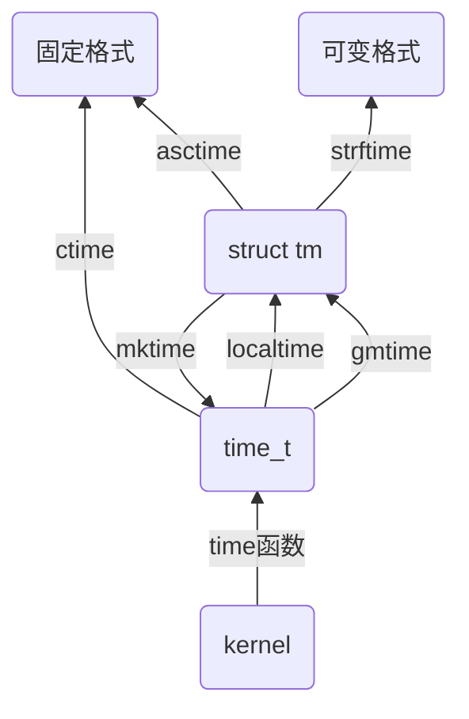

# C库时间函数

## 函数关系

**时间格式**

- time_t：总秒数
- struct tm：年、月、日、时、分、秒

**时间函数**

`time`, `ctime`, `gmtime`, `localtime`, `mktime`, `asctime`, `strftime`

**时间转换关系关系**



## 函数介绍

### ctime

**原型**

```
#include <time.h>

char *ctime(const time_t *timep);
```

**功能**

将time返回的总秒数，转为固定的格式时间

**参数**

`time`函数返回的总秒数的地址

**返回值**

- 成功：转换后的时间字符串的指针
- 失败：返回`NULL`，`errno`被设置

**例子**

```
char *ctime_p = NULL;
ctime_p = ctime(&t);

printf("%s\n", ctime_p);

// output:
// Fri Aug  9 20:20:25 2019
```


### gmtime

**原型**

```
#include <time.h>

struct tm *gmtime(const time_t *timep);
```

**功能**

将`time`返回的总秒数，转为国际时间的年、月、日、时、分、秒

**返回值**

- 成功：返回`struct tm`结构体变量的地址
- 失败：返回`NULL`，`errno`被设置。

**struct tm结构体**

```
struct tm
{
      int tm_sec;         /* 秒 */
      int tm_min;         /* 分 */
      int tm_hour;        /* 时 */
      int tm_mday;        /* 月天 */
      int tm_mon;         /* 月份 */
      int tm_year;        /* 年 */
      int tm_wday;        /* 周天 */
      int tm_yday;        /* 年天 */
      int tm_isdst;       /* 夏时令设置 */
};
```

**例子**

```
struct tm *gmt_p = NULL;
gmt_p = gmtime(&t);
printf("%d\n", gmt_p->tm_hour);
```

### localtime

**原型**

```
#include <time.h>

struct tm *localtime(const time_t *timep);
```

`localtime`功能与`gmtime`完全一致，不过`localtime`返回的是本地时间的年、月、日、时、分、秒

### mktime

**原型**

```
#include <time.h>

time_t mktime(struct tm *tm);
```

**功能**

将`struct tm`变量中的年月日时分秒，反过来转为总秒数

**返回值**

计算得到的总秒数

### asctime

**原型**

```
#include <time.h>

char *asctime(const struct tm *tm);
```

**功能**

负责将`struct tm`中的年月日时分秒，组合为固定格式的时间

**返回值**

转换后时间字符换的指针

**例子**

```
char *p = asctime(gmt_p);
printf("%s\n", p);
```

### strftime

**原型**

```
#include <time.h>

size_t strftime(char *s, size_t max, const char *format, const struct tm *tm);
```
**功能**

将`struct tm`转换成指定的时间格式

**返回值**

返回转换后时间字符串的字符个数

**参数**

- `s`：缓存地址，这个缓存用于存放转换后的字符串
- `max`：缓存的大小
- `tm`：放有年月日时分秒的结构体变量的地址
- `format`：自定义时间格式

**format**

```
%a: Week                    TUE
%A：Week full name          Tuesday
%b：Month                   Jan
%B：Month full name         January
%c：fixed format            Tue Jan 14 19:40:30	1992
%d：Day                     26
%H：Hours(24)               23
%I：Hours(12)               11
%j：Day of the year         089
%m：Month(decimal number)   08
%M：Minute                  55
%p：AM/PM                   PM
%s：seconds                 30					
%w: Weekday(0~6)            0
%x：Date                    01/14/92
%X：Time                    19:40:30
%y：year                    18
%Y：Year                    2018
%z：Timezone                MST、DST、WET、......
```

**例子**

```
char buf[100];
strftime(buf, sizeof(buf), "%Y-%m-%d %X\n", gmt_p);
printf("%s\n", buf);
```

**改进myls**

增加时间显示

```
struct tm *timep = localtime(&fst.st_atime);
char time_buf[50] = {0};
strftime(time_buf, sizeof(time_buf), "%b %d %H:%M", timep);

printf("%d %lu %s %s %ld %s %s",
        fst.st_mode,
        fst.st_nlink,
        passwd_p->pw_name,
        group_p->gr_name,
        fst.st_size,
        time_buf,
        file_name
        );
```
