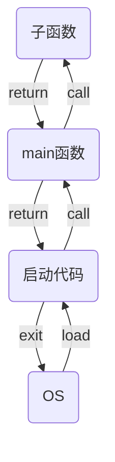
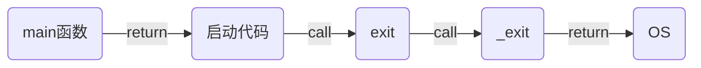
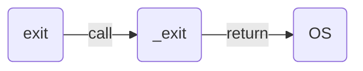
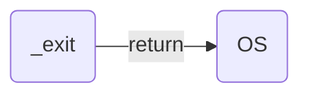

# 进程的终止

进程的终止方式有两种，一种是正常终止，另一种是异常终止。

## 正常终止

进程主动调用终止函数/返回关键字所实现的结束，就是正常终止。

- `main`调用`return`关键字结束
- 程序任何位置调用`exit`函数结束
- 程序任何位置调用`_exit`函数结束

### return

`return`关键字的作用是返回上一级函数

- 如果`main`函数的子函数调用`return`的话，返回的上一级是`main`函数。
- 如果`main`函数调用`return`的话，`main`函数所返回的上一级是启动代码。

**显式调用**

返回值标记的了进程的终止状态

```
return 0;    //正常结束
return -1;   //代表了某种操作失败
return -2;   //代表了另一种的操作失败
return;      //返回值不确定
```

如果没有明确写出返回值，返回值不定，`main`函数会返回最后一次调用的子函数的返回值。
如果`main`函数没有调用任何子函数，则返回`-1`。

测试代码
```
#include <stdio.h>

int fun(void)
{
    return 10;
}

int main(void)
{
    //printf("hello world\n");
    fun();

    return;
}
```

**隐式调用**

如果`main`函数中没有调用`return`，`main`函数中的最后一句代码执行完毕后，会默认的调用`return`返回`0`。

### exit函数

在程序中任何位置调用`exit`都有效。
`main`函数调用`return`返回到启动代码后，启动代码也是调用`exit`函数来实现正常终止的。



**函数原型**

```
#include <stdlib.h>

void exit(int status);
```

从`stdlib.h`这个头文件可知，`exit`函数是一个c库函数。
一般报错处理时，使用`exit`函数

测试代码

```
#include <stdio.h>
#include <stdlib.h>

int fun(void)
{
    //return 10;
    exit(10);

    /* 出错返回
    int fd = open(...);
    if (-1 == fd) {
      perror(open fail);
      exit(-1);
    }
    */
}

int main(void)
{
    //printf("hello world\n");
    fun();

    //return;
}
```

### \_exit函数

`_exit`是一个系统函数（系统API），而`exit`是c库函数，`exit`就是调用`_exit`来实现的。

**函数原型**

```
#include <unistd.h>
void _exit(int status);
```

**对比**

return



exit



\_exit



## 异常终止

进程异常终止指的是进程被信号杀死

**自杀**

自己调用`abort`函数，自己给自己发一个`SIGABRT`信号将自己杀死，杀人凶器是信号

代码

```
#include <stdio.h>
#include <stdlib.h>

int fun(void)
{
    printf("!!!!!!!!\n");
    exit(10);
}

int main(void)
{
    abort();

    fun();
    return 0;
}
```


**他杀**

由别人发一个信号，将其杀死，杀人凶器也是信号。

例如，按`ctrl+c`终止程序
