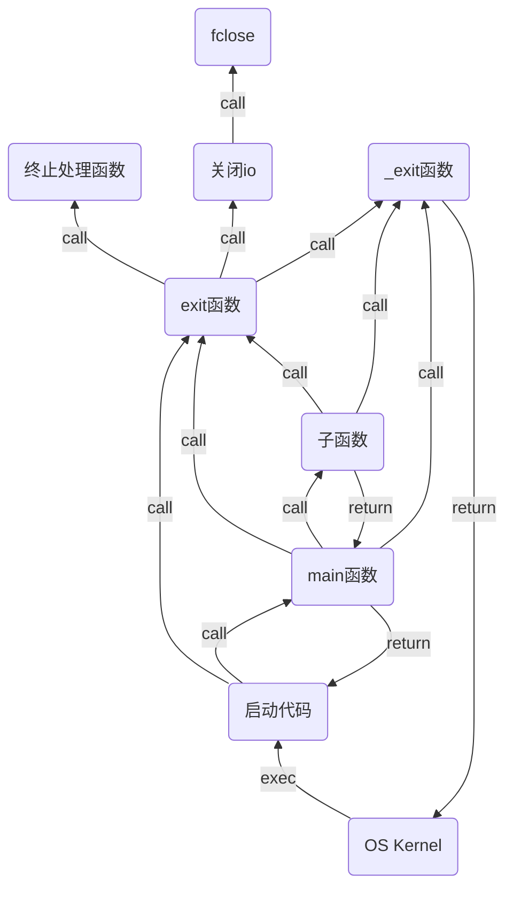

# 进程从启动到终止的全过程

## 一张图



## 刷新标准io缓存

调用`exit`函数终止进程时，`exit`会帮助关闭标准io。调用`fclose`关闭标准输出时，会自动调用`fflush`刷新缓冲。

**缓冲类型**

- 无缓冲
- 行缓冲
- 全缓冲

**行缓冲**

`printf`就是行缓冲的，在缓存中积压的数据，直到出现以下情况时，才会刷新输出

- 遇到`\n`时就刷新输出
- 库缓存中数据满了，也会自动刷新输出
- 调用标准`fflush`函数，主动刷新数据
- 调用`fclose`关闭标准输出时，会自动调用`fflush`刷洗数据


测试代码

```
#include <stdio.h>
#include <unistd.h>

int main(void)
{
    printf("!!!!!!!!!");
    //printf("hello\n");
    //fflush(stdout);
    //fclose(stdout);
    //exit(-1);
    _exit(-1);

    while(1);
    return 0;
}
```

*进程时异常终止的话，是不会刷新缓存区的，因为异常退出时，跟exit函数半毛钱关系都没有*
