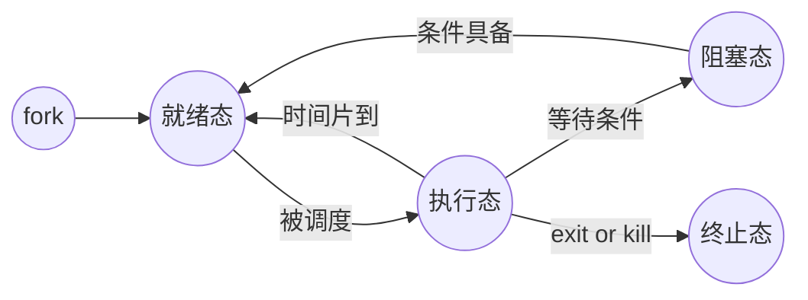

# 进程状态

```mermaid
graph LR;
  id0((fork)) --> id1((就绪态))
  id1 --被调度--> id2((执行态))
  id2 --等待条件--> id3((阻塞态))
  id2 --exit or kill--> id4((终止态))
  id2 --时间片到--> id1
  id3 --条件具备--> id1
```

- 就绪队列
- 阻塞队列
- 调度算法
