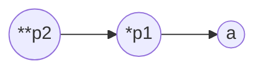

# 多级指针

## 一级指针

所有普通变量的地址都是一级指针，存放一级指针的变量就是一级指针变量

代码

```
char a = 'a';
char *p = &d;
```

符号含义

| 符号 | 含义                                     |
|:-----|:-----------------------------------------|
| `a`  | `char`类型普通变量                       |
| `&a` | `a`的指针，类型为`char *`                |
| `p`  | `char *`型指针变量                       |
| `*p` | `p`中指针所指向的空间                    |
| `&p` | 变量p的指针，指针的指针，类型为`char **` |

## 二级指针

二级指针类型的结构为，一级指针类型 + `*`

代码

```
int a = 100;
int *p1 = &a;
int **p2 = &p1;     //int ** = int * + *
```

符号解释

| 符号   | 含义                                                                    |
|:-------|:------------------------------------------------------------------------|
| `a`    | `int`变量                                                               |
| `p1`   | `int *`指针变量                                                         |
| `*p1`  | `p1`中指针指向的空间，解释方式为`int`                                   |
| `&p1`  | 一级指针变量`p1`的指针，类型为`int **`的二级指针                        |
| `p2`   | `int **`指针变量                                                        |
| `*p2`  | 对`p2`进行一级解引用，代表`p2`中指针指向的空间，解释方式为`int *`       |
| `**p2` | 对`p2`进行二级解引用，代表`p2`所指向的`p1`所指向的空间，解释方式为`int` |
| `&p2`  | 对`p2`取地址，得到`p2`的指针，类型为`int ***`                           |





## 三级指针

三级指针及多级指针根据以上规则类推
