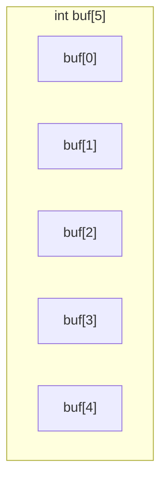

# 一维数组

## 一维数组的内存结构

一维数组的在内存中，为一片连续的内存空间，比如以`int buf[5]`为例：



## 数组元素空间大小

- 每个元素大小由元素类型决定
- 整个数组大小 = 元素个数 x 元素大小

## 数组的定义

**数组的定义形式**

格式：类型 数组名[元素个数]
例如：`int buf[100]`

**定义数组的目的**

从内存中开辟出连续的变量空间，以便我们快速、方便的访问。

## 数组名的含义

比如：`int buf[100]`

`buf`的各种含义

- 数组名，`buf`代表整个数组空间，例如`sizeof(buf)`为整个数组空间大小
- 指针，`buf`作为指针时，代表数组第0个元素的指针，等价于`&buf[0]`。此时`buf`是个指针不是变量，不可以`buff++`

## 数组指针

- `&buf`为数组指针，类型为`int (*)[100]`
- `&buf`与`buf`值相等，但类型不同，`buf`类型为`int *`，`&buf+1` 与 `buf+1`得到的值不同

## 一维数组的赋值

### 不初始化

```
int buf[10];
```
如果是全局数组，每个元素值为0。如果在栈中就是随机值。

### 给定空间初始化

**完全初始化**

对每一个元素初始化对应值

```
int buf[10] = {0, 1, 2, 3, 4, 5, 6, 7, 8, 9};
```

**完全初始化为0**

```
int buf[10] = {};
/* 或者 */
int buf[10] = {0};
```

**部分初始化**

```
int buf[10] = {0, 1, 2, 3, 4};
/* 其余元素值为0 */
```

**个别初始化**

```
int buf[10] = {[2]=5, [7]=100, [5]=34};
/* 未被初始化的元素置0 */
```

### 不指定空间初始化

```
int buf[] = {1, 2, 3, 4, 5};
/* 数组空间大小由初始化元素个数决定 */
```

## 一维数组的赋值

### 数组不允许整体赋值

错误例子

```
int a[10];
a = {0, 1, 2, 3, 4, 5};    //wrong
a[0] = 0;   //right

int b[] = {0, 1, 2 ,3, 4, 5};
a = b;    //wrong

a[0] = b[0];   //right
```

正确例子

```
#include <stdio.h>

int a[10];

int main(void){
    int i;

    for (i=0; i<10; i++)
        scanf("%d", &a[i]);

    for (i=0; i<10; i++)
        printf("%d ", a[i]);

    printf("\n");
    return 0;
}
```

### 数组复制

使用循环

```
for (i=0; i<10; i++)
    buf[i] = a[i];
```

使用memcpy函数

```
#include <stdio.h>
#include <string.h>

int a[10];

int main(void){
    int i;
    int buf[10];

    for (i=0; i<10; i++)
        scanf("%d", &a[i]);

    memcpy((void *)buf, (void *)a, sizeof(a));

    for (i=0; i<10; i++)
        printf("buf[%d] = %d ",i, buf[i]);

    printf("\n");

}
```

memcpy原型

```
void *memcpy(void *dest, const void *src, size_tn);

// dest：指向目标空间
// src：指向源空间
// size_tn：要复制空间的大
```
