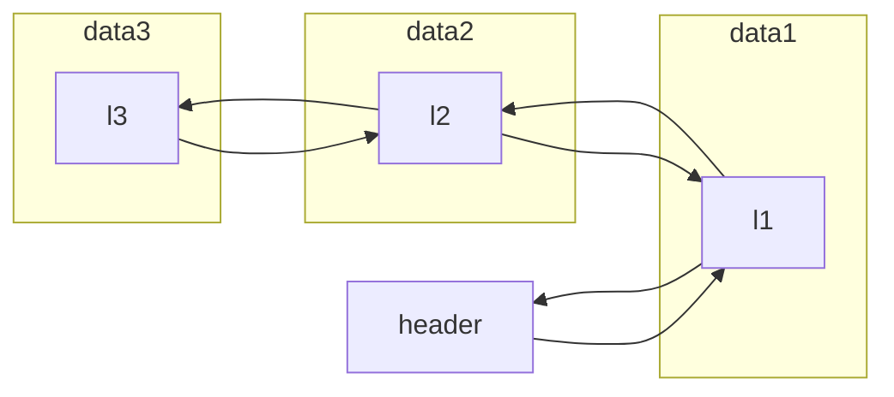

# 内核链表

## 内核链表的定义

**链表结构体**

```
struct list_head
{
  struct list_head *prev, *next;
}
```

**使用内核链表**

将内核链表节点嵌入data结构体

```
struct student_s
{
  struct list_head list;  /* 嵌入链表节点 */
  char name[64];
  int number;
  char gender;
}
```

*头结点需要单独创建，并指向数据节点*

## 内核链表结构



由于是循环链表，l3还需要回指header


## 内核链表基本操作

### 初始化头结点

**接口定义**
```
#define LIST_HEAD_INIT(name) { &(name), &(name) }
#define LIST_HEAD(name) struct list_head name = LIST_HEAD_INIT(name)
```

**使用举例**

```
struct list_head head; 		 //需要我们自己定义“头节点”
INIT_LIST_HEAD(&head);

LIST_HEAD(head);  /* 与以上2条代码等价 */
```

**原理**

自行进行宏替换即可

### 插入节点

**接口定义**

```
/* 通用插入函数 */
static inline void __list_add(struct list_head *new,
                              struct list_head *prev,
                              struct list_head *next)
{
        next->prev = new;
        new->next = next;
        new->prev = prev;
        prev->next = new;
}

/*********前插*********/
static inline void list_add(struct list_head *new, struct list_head *head)
{
        //new：新节点   head：前节点指针  head->next：后节点指针
        __list_add(new, head, head->next);
}

/*********后插*********/
static inline void list_add_tail(struct list_head *new, struct list_head *head)
{           
        //new：新节点   head->prev：前节点指针  head：后节点指针
        __list_add(new, head->prev, head);
}
```

### 删除节点

**接口**

```
/* 通用删除函数 */
static inline void __list_del(struct list_head * prev, struct list_head * next)
{
        next->prev = prev;
        prev->next = next;
}

/*********删除entry所指向的节点*********/
static inline void list_del(struct list_head *entry)
{
        __list_del(entry->prev, entry->next);
        entry->next = LIST_POISON1;  //LIST_POISON1等价于NULL
        entry->prev = LIST_POISON2;  //LIST_POISON2等价于NULL
}

/*********删除entry所指向的节点，并初始化为空链表*********/
static inline void list_del_init(struct list_head *entry)
{
        __list_del(entry->prev, entry->next);
        INIT_LIST_HEAD(entry);
}
```

### 获取数据结构体

**接口**

```
#define list_entry(ptr, type, member) container_of(ptr, type, member)
```

与直接使用`container_of`是一样的，只是换了一个名字而已


### 遍历链表

**接口定义**

```
#define __list_for_each(pos, head) \  
        for (pos = (head)->next; pos != (head); pos = pos->next)

/*********遍历链表节点*********/
#define list_for_each(pos, head) \
        for (pos = (head)->next, prefetch(pos->next); pos != (head); \
              pos = pos->next, prefetch(pos->next))

/********遍历数据节点********/
#define list_for_each_entry(pos, head, member)   \
        for (pos = list_entry((head)->next, typeof(*pos), member);  \
             prefetch(pos->member.next), &pos->member != (head);  \
             pos = list_entry(pos->member.next, typeof(*pos), member))
```

意思就是下边这样：

```
pos = (head)->next
while(1)
{
   if(pos == (head))  break;
   pos = pos->next;
}
```

### 安全性

**接口**

```
/********* 判断链表是否为空，只检查next指针 *********/
static inline int list_empty(const struct list_head *head)
{
        return head->next == head;
}

/********* 判断链表是否为空，检查next和prev *********/
static inline int list_empty_careful(const struct list_head *head)
{
        struct list_head *next = head->next;
        return (next == head) && (next == head->prev);
}
```


>基本的list_empty()仅以头指针的next是否指向自己来判断链表是否为空，Linux链表另行提供了一个list_empty_careful()宏，它同时判断头指针的next和prev，仅当两者都指向自己时才返回真。这主要是为了应付另一个cpu正在处理同一个链表而造成next、prev不一致的情况。但代码注释也承认，这一安全保障能力有限：除非其他cpu的链表操作只有list_del_init()，否则仍然不能保证安全，也就是说，还是需要加锁保护。

## 其他

在Linux链表功能接口中还有一系列以`_rcu`结尾的宏，与以上介绍的很多函数一一对应。

RCU（Read-Copy Update）是2.5/2.6内核中引入的新技术，它通过延迟写操作来提高同步性能。

## 常用操作汇总

（a）INIT_LIST_HEAD：	让头节点的`next`和`prev`指向头节点自己
（b）list_add：				将新节点插入到某节点的后面
（c）list_add_tail：	  将新节点插入到某节点的前面
（d）list_for_each：   遍历链表的宏
（e）list_entry：			使用成员`list`的指针，计算得到包含list成员的结构体变量指针
（f）list_del：				删除某个节点
