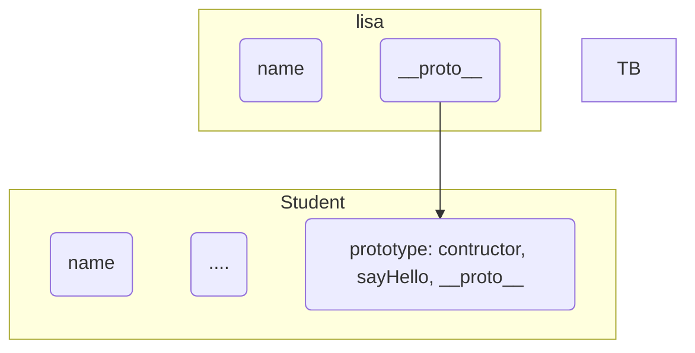
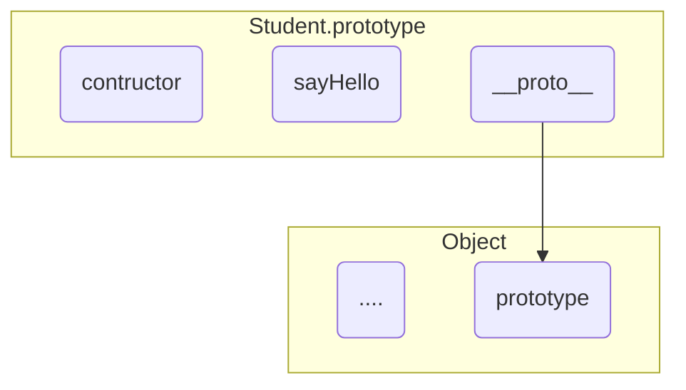
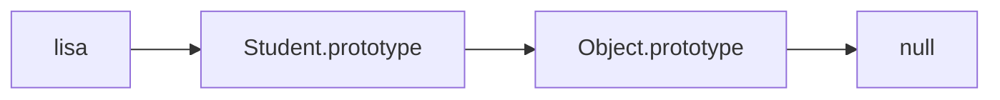

# 原型

## 几个概念

**原型对象**

原型对象 `prototype`，也称 原型属性

它是一个 **对象**，同时也是构造函数的一个属性


**proto属性**

每个对象都有一个 `__proto__` 属性

- `__proto__`默认指向其构造函数的原型属性 `prototype`
- `prototype` 也是对象，所以也有 `__proto__` 属性

**prototype内容**

可以将 **方法** 定义到 `prototype` 的成员中，这样 `new` 出来的方法就会继承到这些方法

`prototype` 中的默认成员

- `__proto__`，指向顶层`Object`的`prototype`属性
- `contructor`，指向自己父亲，就是构造函数


## 图解

**图一**：\_\_proto\_\_



**图二**：prototype




**代码**

```js
let animal = {
  name: "animal",
  eat: function() {
    console.log(this.name + " is eating");
  }
}

// 手动实现继承
let dog = {
  name: "dog",
  __proto__: animal
}

let cat = {
  name: "cat",
  __proto__: animal
}

// function Student(name) {
//   this.name = name;
//   this.sayHello = function() {
//     console.log("Hi, I am " + this.name);
//   }
// }

function Student(name){
  this.name = name;
}

Student.prototype.sayHello = function() {
  console.log("Hi, I am" + this.name);
}

const andy = new Student("andy");
const lisa = new Student("lisa");
```

## 原型链


