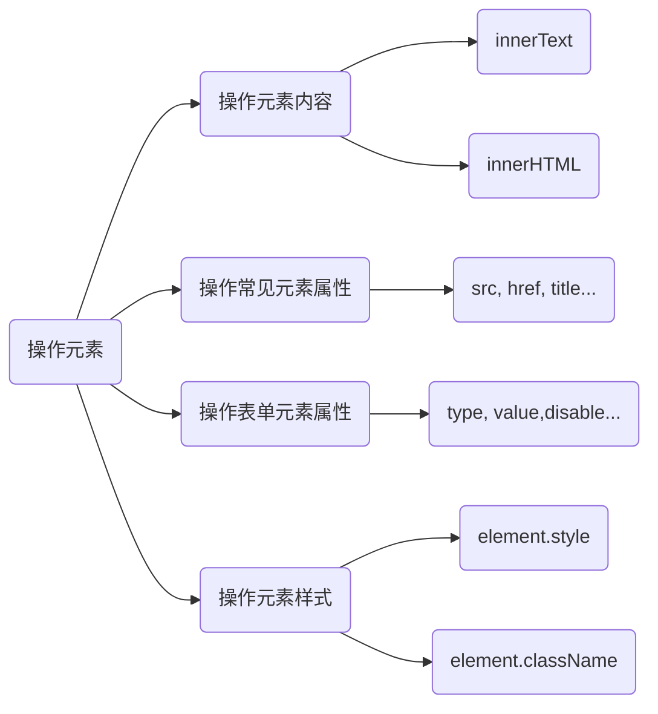

# 操作元素

信息汇总

图：




这些属性都是可读写的

## 练习

**案例一**

表单输入提示显示与隐藏

```html
<head>
  <meta charset="UTF-8">
  <meta name="viewport" content="width=device-width, initial-scale=1.0">
  <title>Document</title>
  <style>
    div {
      width: 500px;
      margin: 10px auto;
      padding: 20px;
      background-color:#fcfcfc;
    }

    input {
      width: 200px;
      border: 1px #ccc solid;
      padding: 5px;
      outline: none;
      color: #ccc;
    }
  </style>
</head>
<body>
  <div>
    <input type="text" value="邮箱/ID/手机号">

  </div>
  <script>
    let ipt = document.querySelector('input');

    ipt.onfocus = function(){
      if(this.value === '邮箱/ID/手机号'){
        this.value = '';
      }
      this.style.borderColor = 'pink';

    }

    ipt.onblur = function(){
      if(this.value === ''){
        this.value = '邮箱/ID/手机号';
      }
      this.style.borderColor = '#ccc';

    }
  </script>
</body>
```

**案例二**

关闭广告

```html
<head>
  <meta charset="UTF-8">
  <meta name="viewport" content="width=device-width, initial-scale=1.0">
  <title>Document</title>
  <style>
    div {
      width: 800px;
      background-color: #fcfcfc;
      margin: 10px auto;
      padding: 20px 10px;
    }

    .close {
      float: right;
      width: 14px;
      height: 14px;
      font-size: 14px;
      font-family: Arial, Helvetica, sans-serif;
      text-align: center;
      border: 1px solid #f0f0f0;
      border-radius: 3px;
      cursor: pointer;
    }
  </style>
</head>
<body>
  <div>
    久趣英语
    <span class="close">X</span>
  </div>
  <script>
    let box = document.querySelector('div');
    let close = document.querySelector('.close');

    close.onclick = function(){
      box.style.display = 'none';
    }
  </script>
</body>
```

**案例三**

开关灯

```html
<body>
  <button>开关灯</button>

  <script>
    let btn = document.querySelector('button');
    let light_on = true;
    btn.onclick = function() {
      if(light_on){
        document.body.style.backgroundColor = 'black';
        light_on = false;
      }else{
        document.body.style.backgroundColor = 'white';
        light_on = true;
      }
    }
  </script>
</body>
```


**案例四**

仿新浪下拉菜单

*下拉菜单，常用a标签加ul实现。详见11.节点操作*


```html
<head>
  <meta charset="UTF-8">
  <meta name="viewport" content="width=device-width, initial-scale=1.0">
  <title>Document</title>
  <style>
    * {
      margin: 0;
      padding: 0;
    }

    body {
      font-family: Microsoft Yahei;
      color: #333;
    }

    a {
      text-decoration: none;
      color: #333;
    }

    a:hover {
      color: #fc9900;

    }

    li {
      list-style: none;
    }

    .nav {
      height: 40px;
      background-color: #fcfcfc;
    }

    .nav-content {
      width: 800px;
      margin: 0 auto;
      font-size: 14px;
    }

    .nav-content>ul>li {
      float: right;
    }

    .nav-item {
      position: relative;
    }

    .nav-item-title {
      line-height: 40px;
      padding: 0 20px;
      cursor: pointer;
    }

    .nav-item-content {
      display: none;
      position: absolute;
      width: max-content;
      background-color: #fff;
      box-shadow: 5px 5px 5px -4px rgba(0, 0, 0, .1);
    }

    .nav-item-content>li {
      border-bottom: 1px solid #fecc5b;
      border-left: 1px solid #fecc5b;
      border-right: 1px solid #fecc5b;
      padding: 5px 15px;
    }

    .nav-item-content>li:hover {
      background-color: #fff5da;
    }

    .content {
      width: 800px;
      height: 500px;
      margin: 10px auto;
      border: 1px solid #ccc;
    }
  </style>
</head>

<body>
  <div class="nav">
    <div class="nav-content">
      <ul>
        <li>
          <div class="nav-item">
            <h5 class="nav-item-title">邮箱</h5>
            <ul class="nav-item-content">
              <li><a href="#">免费邮箱</a></li>
              <li><a href="#">VIP邮箱</a></li>
              <li><a href="#">企业邮箱</a></li>
              <li><a href="#">新浪邮箱客户端</a></li>
            </ul>
          </div>
        </li>
        <li>
          <div class="nav-item">
            <h5 class="nav-item-title">博客</h5>
            <ul class="nav-item-content">
              <li><a href="#">博客评论</a></li>
              <li><a href="#">未读提醒</a></li>
            </ul>
          </div>
        </li>
        <li>
          <div class="nav-item">
            <h5 class="nav-item-title">微博</h5>
            <ul class="nav-item-content">
              <li><a href="#">私信哈哈哈哈</a></li>
              <li><a href="#">评论</a></li>
              <li><a href="#">@我</a></li>
            </ul>
          </div>
        </li>
      </ul>
    </div>
  </div>

  <div class="content">
  </div>
  <script>
    let navs = document.querySelectorAll('.nav-item');
    for (let nav of navs) {
      nav.onmouseover = function () {
        this.querySelector('.nav-item-content').style.display = 'block';
        this.querySelector('.nav-item-title').style.backgroundColor = '#f5f5f5';
      }

      nav.onmouseout = function () {
        this.querySelector('.nav-item-content').style.display = 'none';
        this.querySelector('.nav-item-title').style.backgroundColor = '#fcfcfc';
      }
    }

  </script>

</body>
```
