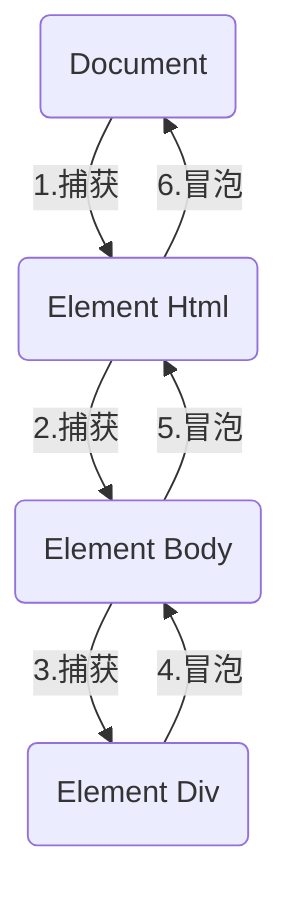

# DOM事件流

## 基础概念

事件流是从页面接收事件的顺序

事件发生时，会在元素节点之间按照特定的顺序传播，这个传播过程即DOM事件流

**三个阶段**

- 捕获阶段
- 当前目标阶段
- 冒泡阶段

**传播过程**

例如给div注册一个点击事件



事件冒泡：IE最早提出，事件开始由最具体的元素接收，然后逐级向上，传播到DOM最顶层节点的过程

事件捕获：网景最早提出，由DOM最顶层节点开始，然后逐级向下，传播到最具体的元素的过程

事件绑定时，只能选择绑定到一种传播过程上，要么捕获，要么冒泡，默认冒泡

## 代码验证

**注意**

- JS代码中只能执行捕获或者冒泡其中一个阶段
- `onclick` 等传统方法和 `attachEvent` 只能得到冒泡阶段
- `addEventListener`，第三个参数决定使用捕获阶段或者冒泡阶段
- 实际开发中很少使用捕获，更多的时候使用冒泡
- 有些时间是没有冒泡的，例如：onblur, onfocus, onmouseenter, onmouseleave
- 事件冒泡特性，可以巧妙的实现一些特性


**捕获流**

```html
<head>
  <meta charset="UTF-8">
  <meta name="viewport" content="width=device-width, initial-scale=1.0">
  <title>Document</title>
  <style>
    .father {
      margin: 100px auto;
      width: 200px;
      height: 200px;
      background-color: pink;
      border: 1px solid pink;
    }

    .son {
      margin: 50px auto;
      width: 100px;
      height: 100px;
      background-color: purple;
    }
  </style>
</head>
<body>
  <div class="father">
    <div class="son"></div>
  </div>
  <script>
    // 使用捕获阶段
    // 捕获顺序：document -> html -> body -> father -> son
    let son = document.querySelector('.son');
    son.addEventListener('click', function(){
      alert('son');
    }, true)

    let father = document.querySelector('.father');
    father.addEventListener('click', function(){
      alert('father');
    }, true)

    document.addEventListener('click', function(){
  alert('document');
})
  </script>
</body>
```


**冒泡流**

`addEventListener` 第三个参数省略

```html
<body>
  <div class="father">
    <div class="son"></div>
  </div>
  <script>
    // 使用冒泡阶段
    // 冒泡顺序：son -> father -> body -> html -> document
    let son = document.querySelector('.son');
    son.addEventListener('click', function(){
      alert('son');
    })

    let father = document.querySelector('.father');
    father.addEventListener('click', function(){
      alert('father');
    })
  </script>
</body>
```

*实际开发中冒泡流更为常用*
