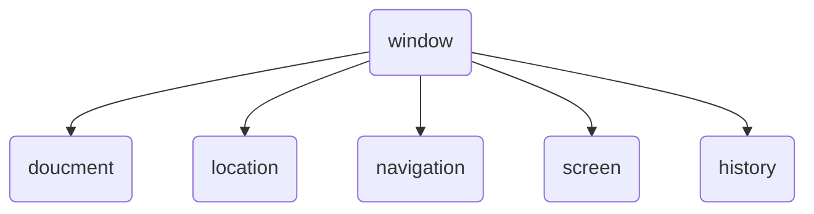

# BOM 基础

浏览器对象模型

- window 对象常见事件
- 定时器
- JS执行机制
- location 对象
- navigator 对象
- history 对象

## BOM 概念

BOM 即浏览器对象模型，它提供了独立于内容与浏览器窗口进行交互的对象，其核心对象就是 `window`

BOM 由一系列相关对象构成，并且每个对象都提供了很多方法与属性

BOM 缺乏标准

- JavaScript语法的标准化组织是ECMA
- DOM的标准化组织是W3C
- BOM 最初是Netscape浏览器标准的一部分

**对比DOM**

| DOM                                     | BOM                                               |
|:--------------------------------------- |:------------------------------------------------- |
| 文档对象模型                            | 浏览器对象模型                                    |
| DOM就是把【文档】当做一个【对象】来看待 | 把【浏览器】当做一个【对象】                      |
| DOM的顶级对象是 `doucment`              | BOM的顶级对象是 `window`                          |
| DOM主要是操作页面元素                   | BOM主要是和浏览器窗口进行交互                     |
| DOM是W3C的标准                          | BOM是各浏览器厂家在各自浏览器上定义的，兼容性较差 |

**BOM的构成**

BOM 包含 DOM



**window对象**

- 它是JS访问浏览器窗口的一个接口
- 它是一个全局对象，定义在全局作用域的变量、函数，都会成为`window` 对象的属性和方法

```js
// let 声明的对象不是全局window下面的属性哦
var myVar1 = 10;
console.log(window.myVar1);

function fn(){
  console.log('fn: 1111');
}

window.fn();
// window可以省略
```

`alert()`, `prompt()` 都是 `window` 对象的方法
