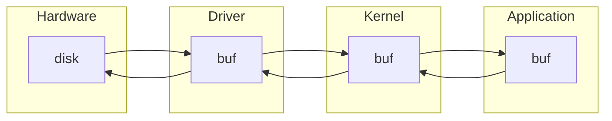

# 文件的open操作

文件打开失败，返回-1并设置错误号

文件打开成功
  - 记录文件打开的信息
  - 开辟内核缓存

## 记录文件打开信息

1. 进程创建成功后，OS会为该进程维护一个`task_struct`结构体
2. 文件成功打开后，OS会更新`task_struct`结构体中的文件描述符表，记录被打开的文件信息

## 开辟内核缓存

**缓存**

- 就是开辟的一段内存空间，比如`char buf[100]`，这就是一段100字节的缓存空间，用于临时存放中转的数据

**内核缓存**

- open是内核提供的，它会在内核中开辟缓存

**应用缓存**

- 应用程序中开辟的缓存，例如`buf1`, `buf2`

**为什么需要缓存**

- 内存读写速度 > 磁盘读写速度的。读写之前先操作缓存，提高效率

**数据流向**

