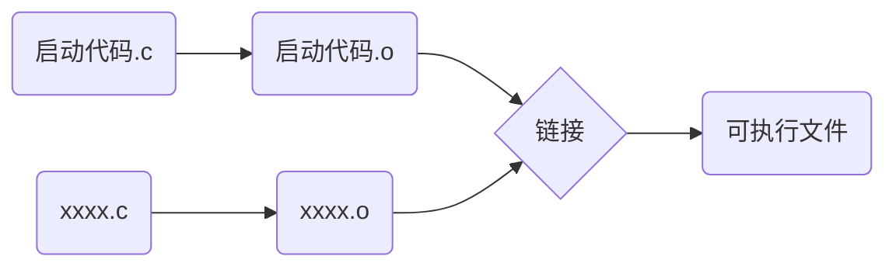
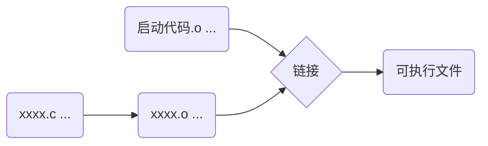

# 启动代码

## 启动代码的来源

启动代码一般都是由编译器提供的，一般有两种提供方式

- 源码形式
- 二进制的.o（目标文件）形式

**源码形式**

开发单片机这种没有OS的计算机的C程序时，启动代码一般是源码形式提供的

**二进制形式**

如果程序是基于OS运行，编译器一般会以.o形式提供启动代码

gcc -v可以查看到链接启动代码的过程

## 启动代码的作用

- 对c程序的内存空间进行布局，例如开辟栈空间
- 留下相应的库接口与
- 其他，例如c++，调用全局构造函数，创建全局对象

## 程序的启动

基于OS运行时，OS会提供相应的系统调用，将程序从硬盘拷贝到内存，并将PC指向内存中程序的第一条指令。
详见C-01-12
