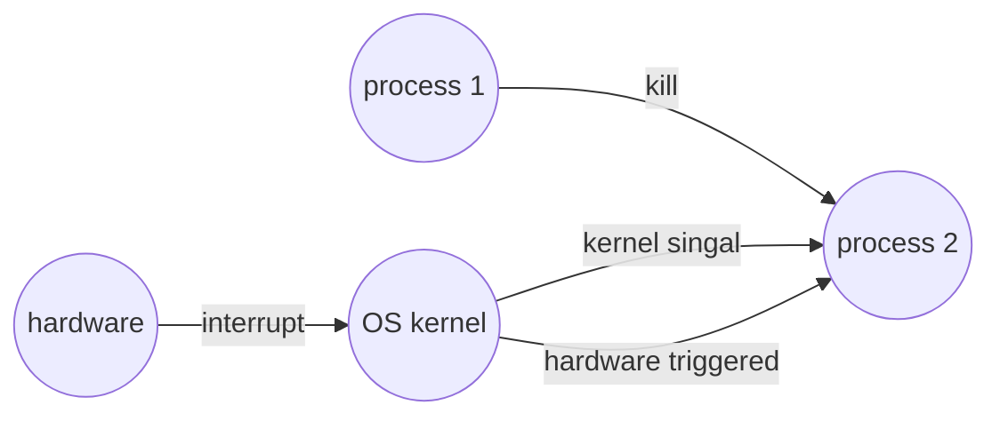

# 信号基础

信号是一种向进程发送通知，告诉其某件事情发生了的一种简单通信机制。

## 信号的命名

Linux下定义了很多的信号，所有的信号都是一个整数编号，
为了好辨识，Linux系统给这些整数编号都定义了对应的宏名，例如`SIGINT`, `SIGKILL`, `SIGABRT`等

Linux下可以用`kill -l`查看信号编号和名称

## 信号的发送

**三种信号源**

- 其他进程
- Kernel，例如某个事件发生了
- 硬件，例如某个硬件事件发生了，例如按下`ctrl+c`

**图**：

**注**

大多数发送信号的原因，都是因为内核、硬件发生了某些事件时，才会向某个进程发送
	该事件专用的信号，告诉该进程这个事件发生了。

## 信号的处理

三种处理方式

- 忽略，不做任何处理
- 捕获，调用相应的处理函数处理
- 默认，使用系统默认的处理方式进行处理

## 常用信号

| Signal    | Value | Description                                   | Action    |
|:--------- |:----- | --------------------------------------------- | --------- |
| `SIGABRT` | 6     | Abort signal from `abort` function, self-kill | Core      |
| `SIGALRM` | 14    | Timer signal from `alarm` function            | Terminate |
| `SIGBUS`  | 7     | hardware failure                              | Core      |
| `SIGCHLD` | 17    | Child stopped or terminated                   | Ignore    |
| `SIGINT`  | 2     | Interrupt from keyboard `ctrl+c`              | Terminate |
| `SIGIO`   | 29    | AIO                                           | Terminate |
| `SIGKILL` | 9     | Kill signal                                   | Terminate |
| `SIGPIPE` | 13    | Broken pipe: write to pipe with no readers    | Terminate |
| `SIGQUIT` | 3     | Quit from keyboard `ctrl+\`                   | Core      |
| `SIGSEGV` | 11    | Invalid memory reference                      | Core      |
| `SIGTERM` | 15    | Termination signal                            | Terminate |
| `SIGUSR1` | 10    | User defined signal                           | Terminate |
| `SIGUSR2` | 12    | User defined signal                           | Terminate |

## core文件

core文件保存了程序（进程）在当前结束的这一刻，在内存中的代码和数据

- core文件是二进制的
- core文件可以用于分析进程在结束时的状况
- core文件相当于进程的尸体
- 操作系统默认丢弃core文件，可以通过设置打开

## kill和pkill

`kill`和`pkill`命令可以给进程发送信号，不过仅仅是发送信号而已，
进程如何处理取决于进程对该信号的处理方式
