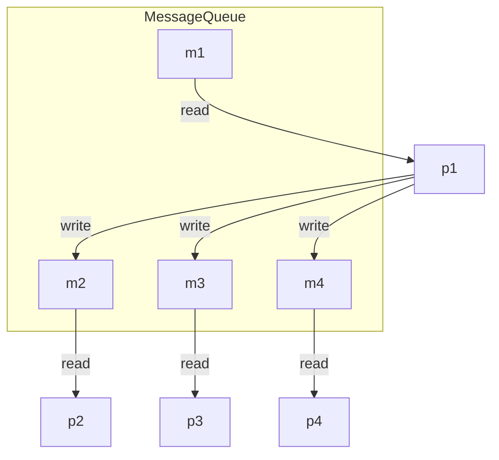

# 消息队列

## 消息队列原理

消息队列的本质就是由内核创建的用于存放消息的链表，通信的进程通过共享操作同一个消息队列，就能实现进程间通信。


**消息**

链表上的每一个节点就是一个消息，消息包含：

- 消息编号：识别消息用
- 消息正文：真正的信息内容


消息结构体

```
struct msgbuf
{
      long mtype;         /* 放消息编号，必须> 0 */
      char mtext[msgsz];  /* 消息内容（消息正文） */
};
```

**发送消息**

1. 进程先封装一个消息包（消息结构体）
2. 调用相应的API发送消息

**接收消息**

调用API接收消息，必须传递两个重要的信息：

- 消息队列标识符
- 你要接收消息的编号

## 网状交叉通信

使用管道很难实现网状交叉通信，但是使用消息队列就非常容易

如图



说明：
- p1和其他进程通信
- 其他进程也可以向m1写入数据，与p1通信
