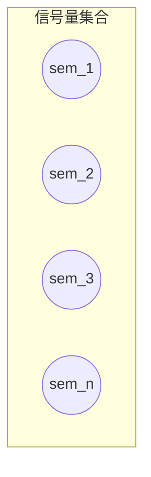

# 信号量实现互斥

## 互斥原理

简单理解的话，信号量其实是OS创建的一个共享变量，进程在进行操作之前，会先检查这个变量的值，这变量的值就是一个标记，通过这个标记就可以知道可不可以操作，以实现互斥。

**二值信号量**

二值信号量的值就两个，`0`和`1`，`0`表示不可以操作，`1`表示可以操作。同步和互斥都可以用二值信号量实现。

**多值信号量**

信号量的最大值>1，比如为3的话，信号量允许的值为`0`、`1`、`2`、`3`

- `0`代表不可以操作
- `1`, `2`, `3`代表可以操作
- `3`进行p操作后变`2`
- `2`进行p操作后变`1`
- `1`进行p操作后变`0`

**信号量集合**

所谓集合就是可能会包含好多个信号量

- 用于互斥时，集合中只包含一个信号量。
- 用于同步时，集合中会包含多个信号量，至于多少个，需要看情况。

*可以想象一下红绿灯*




## 信号量的使用步骤

1. 进程调用`semget`函数创建或获取信号量集合
2. 调用`semctl`函数给集合中的每个信号量设置初始值，只由一个进程来完成
3. 调用`semop`函数，对集合中的信号量进行pv操作
    - p操作（加锁）：对信号量的值进行-1，如果信号量的值为`0`，p操作就会阻塞
    - v操作（解锁）：对信号量的值进行+1，V操作不存在阻塞的问题
4. 调用`semctl`删除信号量集合

## API

### semget

**函数原型**

```
#include <sys/types.h>
#include <sys/ipc.h>
#include <sys/sem.h>

int semget(key_t key, int nsems, int semflg);
```

**功能**

根据`key`值创建新的、或者获取已有的信号量集合，并返回其标识符

**参数**

`key`：设置同消息队列和共享内存
`nsems`：指定集合中信号量的个数
`semflg`：设置同消息队列和共享内存，一般都设置为`0664|IPC_CREAT`

**返回值**

调用成功则返回信号量集合的标识符，失败则返回`-1`，并且`errno`被设置

### semctl

**函数原型**

```
#include <sys/types.h>
#include <sys/ipc.h>
#include <sys/sem.h>

int semctl(int semid, int semnum, int cmd, ...);
```

**功能**

根据cmd的要求对集合中的各个信号量进行控制，...表示它是一个变参函数，如果第四
个参数用不到的话，可以省略不写。

**返回值**

调用成功返回非-1值，失败则返回-1，errno被设置

**参数**

1. `semid`：信号量标识符
2. `semnum`：集合中某个信号量的编号，信号量从0开始编号的
3. `cmd`：控制选项
    - `IPC_STAT`：将信号量的属性信息从内核读到第四个参数所以指定的`struct semid_ds`缓存中
    - `IPC_SET`：用`struct semid_ds`结构体变量修改属性信息
    - `IPC_RMID`：删除信号量集合，给定semid即可
    - `SETVAL`：通过第四个参数，给集合中`semnu`编号的信号量设置一个`int`初始值
    - 其他
4. `...`：变参，用联合体实现

**第四个参数**

第四个参数为`union semun`联合体

```
union semun {
    int              val;    /* Value for SETVAL */
    struct semid_ds *buf;    /* Buffer for IPC_STAT, IPC_SET */
    unsigned short  *array;  /* Array for GETALL, SETALL */
    struct seminfo  *__buf;  /* Buffer for IPC_INFO
                                (Linux-specific) */
};
```

成员：

- `val`：存放用于初始化信号量的值
- `buf`：存放`struct semid_ds`结构体变量的地址

*这个联合体并没有被定义在信号量相关的头文件中，使用的时候需要我们自己定义*

### semop

对信号量进行操作

**函数原型**

```
#include <sys/types.h>
#include <sys/ipc.h>
#include <sys/sem.h>

int semop(int semid, struct sembuf *sops, size_t nsops);
```

**功能**

对指定的信号量进行p操作、或者是v操作

- p操作：将信号量的值-1
  当信号量的值为`0`时，p操作默认是阻塞的

- v操作：将信号量的值+1
  v操作不存在阻塞的问题

**返回值**

调用成功返回0，失败则返回`-1`，`errno`被设置

**参数**

`semid`：信号量集合的标识符
`sops`：结构体数组`struct sembuf sops[]`，每个元素标定一个信号以及p/v操作
`nsops`：数组元素个数

**结构体sembuf**


```
struct sembuf
{
        unsigned short sem_num;  /* semaphore number */
        short          sem_op;   /* semaphore operation */
        short          sem_flg;  /* operation flags */
}
```

说明

- `sem_num`：信号量编号
- `sem_op`：设置p/v操作
    - 设置为`-1`，表示进行p操作
    - 设置`1`，表示进行v操作
- `sem_flg`：
    - `IPC_NOWAIT`： 不阻塞
      一般情况下，当信号量的值为`0`时进行p操作的话，`semop`的p操作会阻塞。
      如果不想阻塞的话，可以指定这个选项，`NOWAIT`就是不阻塞的意思。

      不过除非某些特殊情况，否则我们不需要设置为非阻塞。

    - `SEM_UNDO`：防止死锁
      以二值信号量为例，当进程在v操作之前就结束时，信号量的值就会一直保持为`0`，
      那么其它进程将永远无法p操作成功，会使得进程永远休眠下去，这造成就是死锁。

      但是设置了`SEM_UNDO`选项后，如果进程在结束时没有V操作的话，
      OS会自动帮忙V操作，防止死锁。


### 代码

file: semaphore.h

```
#ifndef H_SEM_H
#define H_SEM_H

extern void print_err(char *estr);
extern int create_or_get_sem(int nsems);
extern void init_sem(int semid, int semnum, int val);
extern void del_sem(int semid);
void p_sem(int semid, int semnum[], int nsops);
void v_sem(int semid, int semnum[], int nsops);

#endif
```

file:semaphore.c

```
#include <stdio.h>
#include <stdlib.h>
#include <unistd.h>
#include <sys/types.h>
#include <sys/stat.h>
#include <fcntl.h>
#include <sys/ipc.h>
#include <sys/sem.h>

#define SEM_FILE "./semfile"

/* semctl第四个参数 */
union semun {
    int              val;    /* Value for SETVAL */
    struct semid_ds *buf;    /* Buffer for IPC_STAT, IPC_SET */
    unsigned short  *array;  /* Array for GETALL, SETALL */
    struct seminfo  *__buf;  /* Buffer for IPC_INFO
                                (Linux-specific) */
};


void print_err(char *estr)
{
        perror(estr);
        exit(-1);
}

/* 创建信号量 */
int create_or_get_sem(int nsems)
{
        int semid;
        int fd = -1;
        key_t key = -1;

        fd = open(SEM_FILE, O_RDWR|O_CREAT, 0664);
        if (fd == -1)
                print_err("open fail");

        key = ftok(SEM_FILE, 'A');
        if (key == -1)
                print_err("ftok fail");

        semid = semget(key, nsems, 00664|IPC_CREAT);
        if (semid == -1)
                print_err("semget fail");

        return semid;
}


/* 初始化信号量 */
void init_sem(int semid, int semnum, int val)
{
        int ret = -1;
        union semun sem_un;
        sem_un.val = val;

        ret = semctl(semid, semnum, SETVAL, val);   /* 直接传整形也可以 */
        //ret = semctl(semid, semnum, SETVAL, sem_un);
        if (ret == -1)
                print_err("semctl fail");

}


/* 删除信号量 */
void del_sem(int semid)
{
       int ret = -1;

       ret = semctl(semid, 0, IPC_RMID);
       if (ret == -1)
                print_err("semctl del fail");

       remove(SEM_FILE);
}


/* 对信号量进行p操作 */
void p_sem(int semid, int semnum[], int nsops)
{
        /* int semid: 信号量集合标识符
         * int semnum[]: 信号量编号的集合
         * int nsops：信号量个数
         */

        int i = 0;
        int ret = -1;

        //int semop(int semid, struct sembuf sops[], size_t nsops);

        struct sembuf sops[nsops];


        for (i = 0; i<nsops; i++) {
                sops[i].sem_num = semnum[i];
                sops[i].sem_op = -1;
                sops[i].sem_flg = SEM_UNDO;
        }

        ret = semop(semid, sops, nsops);
        if (ret ==- 1)
                print_err("semop fail");

}


/* 对信号量进行v操作 */
void v_sem(int semid, int semnum[], int nsops)
{
        int i = 0;
        int ret = -1;

        //int semop(int semid, struct sembuf sops[], size_t nsops);

        struct sembuf sops[nsops];


        for (i = 0; i<nsops; i++) {
                sops[i].sem_num = semnum[i];
                sops[i].sem_op = 1;
                sops[i].sem_flg = SEM_UNDO;
        }

        ret = semop(semid, sops, nsops);
        if (ret ==- 1)
                print_err("semop fail");

}
```

file: mutex_sem.c

```
#include <stdio.h>
#include <stdlib.h>
#include <fcntl.h>
#include <unistd.h>
#include <sys/types.h>
#include <sys/stat.h>
#include "semaphore.h"
#include <signal.h>

#define NSEMS 1     /* 集合中信号量的个数 */


int semid = -1;

void signal_fun(int signo)
{
        del_sem(semid);  /* 捕获信号SIGINT，删除信号量 */
        exit(-1);
}

int main(void)
{
        int ret = -1;
        int fd = -1;

        /* 测试文件 */
        fd = open("./file", O_RDWR|O_CREAT|O_TRUNC, 0664);
        if (fd == -1)
                print_err("open fail");

        /* 创建信号量集合 */
        semid = create_or_get_sem(NSEMS);

        int i = 0;

        /* 初始信号集合中的信号量为1 */
        for (i=0; i<NSEMS; i++) {
                init_sem(semid, i, 1);
        }

        /* 创建子进程 */
        ret = fork();
        /* parent */
        if (ret > 0) {
                /* 注册信号处理函数 */
                signal(SIGINT, signal_fun);

                int semnum[1] = {0};
                while (1) {
                        p_sem(semid, semnum, 1);    /* p操作 */
                        write(fd, "hello ", 6);
                        write(fd, "workd\n", 6);
                        v_sem(semid, semnum, 1);    /* v操作 */
                }

        }
        /* child */
        else if(ret == 0) {
                int semnum[1] = {0};
                while (1) {
                        p_sem(semid, semnum, 1);    /* p操作 */
                        write(fd, "hhhhh ", 6);
                        write(fd, "wwwww\n", 6);
                        v_sem(semid, semnum, 1);    /* v操作 */
                }

        }

        return 0;

}
```
