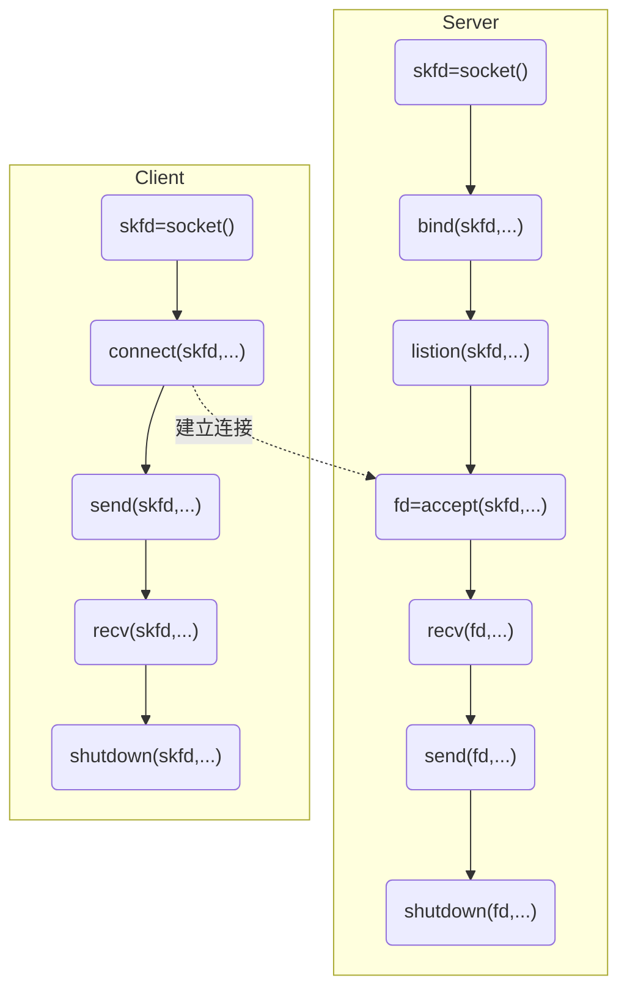

# socket 模型

**图**

```mermaid
graph TD
  subgraph Server
    s0("skfd=socket()") --> s1
    s1("bind(skfd,...)") --> s2
    s2("listion(skfd,...)") --> s3
    s3("fd=accept(skfd,...)") --> s4
    s4("recv(fd,...)") --> s5
    s5("send(fd,...)") --> s6
    s6("shutdown(fd,...)")
  end
  subgraph Client
    c0("skfd=socket()") --> c1
    c1("connect(skfd,...)") --> c2
    c2("send(skfd,...)") --> c3
    c3("recv(skfd,...)") --> c4
    c4("shutdown(skfd,...)")
  end

  c1 -.建立连接.-> s3
```
