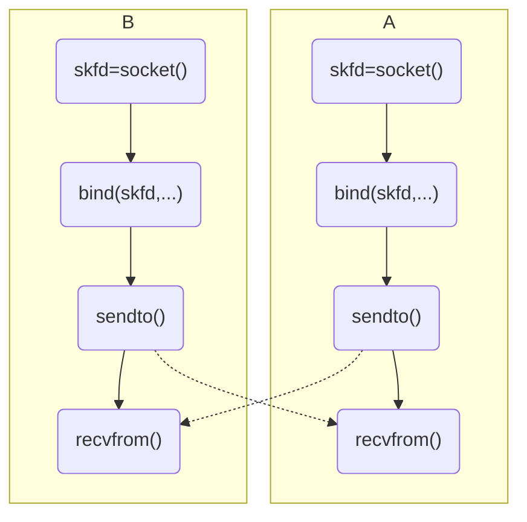
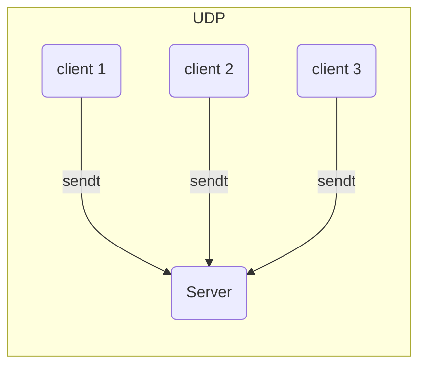

# UDP通信

用户数据报协议，它是一种面向无连接的不可靠传输层协议

## UDP的特点

1. UDP是不可靠传输协议
    - 不建立连接
    - 没有应答机制
    - 没有拥塞避免的流控机制
2. 每次传输数据时，必须指定对方IP和端口
    - TCP建立连接时，会记录对方的IP和端口，后续调用`recv`, `send`时，就不需要再指定了
    - UDP没有建立连接特性，不会记录对方的IP和端口

## 使用UDP

对于数据量很大，但允许数据丢失的通信，可以使用UDP，例如视频、音频。

## UDP编程模型

图：



*如果需要接收数据，一定要绑定固定IP和端口*


通过UDP的编程模型可以看出，UDP通信双方要做的事情一摸一样的，所以对于UDP通信的双方来说，不需要区分谁是服务器端、谁是客户端，通信双方的身份完全是对等的，所以UDP通信也被称为对等通信，或者叫“点对点”通信。

## 相关函数

### sendto

**原型**

```
#include <sys/types.h>
#include <sys/socket.h>

ssize_t sendto(int sockfd, const void *buf, size_t len, int flags,
          const struct sockaddr *dest_addr, socklen_t addrlen);
```

**功能**

发送数据，当后两个参数为`NULL`和`0`时，功能等价于`send`。
但对于像UDP这种非连接的通信，必须使用`sendto`，因为此时必须使用最后两个参数。

**返回值**

成功返回发送的字节数，失败返回-1，errno被设置

**参数**

1. sockfd：`socket()`函数返回的套接字文件描述符
2. buff：应用缓存
3. len：应用缓存的大小
4. flags：一般写0，表示阻塞发送，其他设置同`send`
5. dest_addr：目标IP和端口
6. addrlen：`dest_addr`的大小


### recvfrom

**原型**

```
#include <sys/types.h>
#include <sys/socket.h>

ssize_t recvfrom(int sockfd, void *buf, size_t len, int flags,
      struct sockaddr *src_addr, socklen_t *addrlen);
```

**功能**

接收数据，最后两个参数与`NULL`和`NULL`时，功能与`recv`功能相同。
UDP通信时，常使用的是`recvfrom`函数，因为需要用到后两个参数。

**返回值**

成功返回接收到的字节数，失败返回-1，ernno被设置

**参数**

1. sockfd：`socket()`函数返回的套接字文件描述符
2. buff：应用缓存
3. len：应用缓存的大小
4. flags：一般写0，表示阻塞接收，其他设置同`recv`
5. src_addr：用于保存发送方的IP和端口，以便回答对方
6. addrlen：`src_addr`的大小


## 代码示例

file: udp_a.c

```
#include <stdio.h>
#include <stdlib.h>
#include <unistd.h>
#include <sys/types.h>
#include <sys/socket.h>
#include <errno.h>
#include <string.h>
#include <arpa/inet.h>
#include <netinet/in.h>
#include <pthread.h>
#include <signal.h>

int sockfd = -1;


void print_err(char *msg, int line, int err_no)
{
    printf("line: %d, %s, %s\n", line, msg, strerror(err_no));
    exit(-1);

}


/* 次线程接收数据 */
void *pth_fun(void *pth_arg)
{
    int ret = -1;
    char buf[100];
    struct sockaddr_in peer_addr = {};
    int peer_addr_len = sizeof(peer_addr);

    while(1)
    {

        bzero(buf, sizeof(buf));
        ret = recvfrom(sockfd, buf, sizeof(buf), 0,
                (struct sockaddr *)&peer_addr, &peer_addr_len);
        if(ret == -1)
            print_err("recvfrom fail", __LINE__, errno);
        else if(ret > 0)
        {
            printf("peer ip: %s, peer port: %d\n",
                    inet_ntoa(peer_addr.sin_addr),
                    ntohs(peer_addr.sin_port));
            printf("%s\n", buf);
        }
    }
}


int main(int argc, char *argv[])
{
    if(argc != 3)
    {
        printf("%s <peer_ip> <peer_port>\n", argv[0]);
        exit(-1);
    }
    int ret = 0;
    sockfd = socket(PF_INET, SOCK_DGRAM, 0);
    if(sockfd == -1)
        print_err("socket fail", __LINE__, errno);

    struct sockaddr_in addr;
    addr.sin_family = AF_INET;
    addr.sin_port   = htons(5001);
    addr.sin_addr.s_addr = inet_addr("192.168.8.140");
    ret = bind(sockfd, (struct sockaddr *)&addr, sizeof(addr));
    if(ret == -1)
         print_err("bind fail", __LINE__, errno);

    pthread_t tid;
    ret = pthread_create(&tid, NULL, pth_fun, NULL);
    if(ret != 0)
        print_err("pthread_create fail", __LINE__, errno);

    char buf[100] ={0};
    struct sockaddr_in peer_addr = {};
    while(1)
    {
        peer_addr.sin_family = AF_INET;
        peer_addr.sin_port = htons(atoi(argv[2]));
        peer_addr.sin_addr.s_addr = inet_addr(argv[1]);
        bzero(buf, sizeof(buf));
        scanf("%s", buf);
        ret = sendto(sockfd, buf, sizeof(buf), 0, (struct sockaddr *)&peer_addr,
                sizeof(peer_addr));
        if(ret == -1)
            print_err("sendto fail", __LINE__, errno);

    }

    return 0;
}
```

再创建一个udp_b.c，把端口号改了，就可以在本机互相通信了


## 补充

由于UDP没有应答确认机制，所以UDP是不可靠通信。不过可以在应用层加入确认机制，以弥补UDP的不足

## UDP服务器

使用UDP实现服务器时，服务器是由应用程序本身来构建的，而不是UDP协议。此时通信依然是对等的。



UDP服务器可以使用链表保存客户端IP和端口，用于后续通信。也可以不保存，只接收数据，例如syslog

## 实现两台PC之间通信

两种方法

- 通过服务器中转
- 直接通信


**服务器中转**

- 可以是TCP或UDP
- 客户A发送数据到服务器，服务器转发数据到客户B


**直接通信**

- 只能是UDP
- 前提是有一个TCP或UDP服务器传递客户端的UDP端口信息
