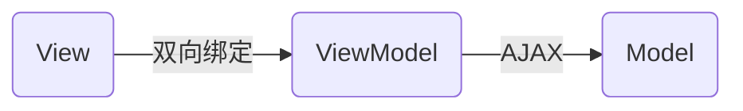

# Vue基础


## MVVM



MVVM和MVC一样都是为了分离视图和模型

- Model：后台业务逻辑和数据库
- View：页面视图
- ViewModel


数据双向绑定

- 数据改变视图自动改变
- 视图变化，数据也会同步变化


SoC关注点分离原则

借鉴了
- 模块化开发(AngulaJS)
- 虚拟DOM(React)

**ViewModel**

ViewModel对model提供的数据进行转换，并封装提供给视图层使用。ViewModel封装出来的数据模型包括：

- 视图的状态（展示）
- 视图的行为（交互）


## helloworld

v-text
v-html

插值，“Mustache”语法 (双大括号)

```html
<!DOCTYPE html>
<html lang="en">
<head>
  <meta charset="UTF-8">
  <meta name="viewport" content="width=device-width, initial-scale=1.0">
  <title>Document</title>
</head>
<body>
  <!-- View层：模板 -->
  <div id="app">
    {{message}}
  </div>

  <script src="https://cdn.jsdelivr.net/npm/vue/dist/vue.js"></script>
  <script>
    let vm = new Vue({
      el: "#app",
      // model层：数据
      data: {
        message: "Hello Vue!"
      }
    })
  </script>
</body>
</html>
```

调试一下

```
> vm.message="hello 1"
```


## 基础语法

### v-bind

Mustache 语法不能作用在 HTML attribute 上，遇到这种情况应该使用 `v-bind` 指令


```html
<body>
  <!-- View层：模板 -->
  <div id="app">
    <span v-bind:title="message">鼠标悬停看一下</span>
  </div>

  <script src="https://cdn.jsdelivr.net/npm/vue/dist/vue.js"></script>
  <script>
    let vm = new Vue({
      el: "#app",
      // model层：数据
      data: {
        message: '页面加载于 ' + new Date().toLocaleString()
      }
    })
  </script>
</body>
```


### v-if


```html
<body>
  <!-- View层：模板 -->
  <div id="app">
    <h1 v-if="ok">yes</h1>
    <h1 v-else>no</h1>
  </div>

  <script src="https://cdn.jsdelivr.net/npm/vue/dist/vue.js"></script>
  <script>
    let vm = new Vue({
      el: "#app",
      // model层：数据
      data: {
        ok: true,
        message: "Hello Vue!"
      }
    })
  </script>
</body>
```

else-if

```html
<body>
  <!-- View层：模板 -->
  <div id="app">
    <h1 v-if="type === 'A'">type A</h1>
    <h1 v-else-if="type === 'B'">type B</h1>
    <h1 v-else-if="type === 'C'">type C</h1>
    <h1 v-else>type D</h1>
  </div>

  <script src="https://cdn.jsdelivr.net/npm/vue/dist/vue.js"></script>
  <script>
    let vm = new Vue({
      el: "#app",
      // model层：数据
      data: {
        ok: true,
        type: "A"
      }
    })
  </script>
</body>
```


### v-for

```html
<body>
  <!-- View层：模板 -->
  <div id="app">
    <li v-for="item in items">{{item.message}}</li>
  </div>

  <script src="https://cdn.jsdelivr.net/npm/vue/dist/vue.js"></script>
  <script>
    let vm = new Vue({
      el: "#app",
      // model层：数据
      data: {
        items: [
          {message: "java"},
          {message: "c++"},
          {message: "rust"}
        ]
      }
    })
  </script>
</body>
```

也可以同时把index遍历出来

```html
<li v-for="(item, index) in items">{{index}}. {{item.message}}</li>
```

### v-on

事件处理

```html
<body>
  <div id="app">
    <!-- 使用v-on绑定事件与对应的方法 -->
    <button v-on:click="sayHi">click me</button>
  </div>

  <script src="https://cdn.jsdelivr.net/npm/vue/dist/vue.js"></script>
  <script>
    let vm = new Vue({
      el: "#app",
      data: {
        message: "HI~"
      },
      // 定义方法
      methods: {
        sayHi: function(){
          alert(this.message);
        }
      }
    });
  </script>
</body>
```


### v-model

数据双向绑定


```html
<body>
  <div id="app">
    输入：<input type="text" v-model="message">
    <br>
    回显：{{message}}
  </div>

  <script src="https://cdn.jsdelivr.net/npm/vue/dist/vue.js"></script>
  <script>
    let vm = new Vue({
      el: "#app",
      data: {
        message: ""
      }
    });
  </script>
</body>
```


raido绑定

```html
<body>
  <div id="app">
    性别：
    <label for="male">男</label>
    <input type="radio" id="male" name="sex" value="男" v-model="gender" >
    <label for="female">女</label>
    <input type="radio" id="female" name="sex" value="女" v-model="gender">

    <p>选择了：{{gender}}</p>
  </div>

  <script src="https://cdn.jsdelivr.net/npm/vue/dist/vue.js"></script>
  <script>
    let vm = new Vue({
      el: "#app",
      data: {
        gender: ""
      }
    });
  </script>
</body>
```

select绑定

```html
<body>
  <div id="app">
    选择：
    <select name="" id="" v-model="selected">
      <option value="" disabled>---请选择---</option>
      <option value="abc">ABC</option>
      <option value="xyz">XYZ</option>
      <option value="hello">你好</option>
    </select>

    <p>value: {{selected}}</p>
  </div>

  <script src="https://cdn.jsdelivr.net/npm/vue/dist/vue.js"></script>
  <script>
    let vm = new Vue({
      el: "#app",
      data: {
        selected: ""
      }
    });
  </script>
</body>
```
