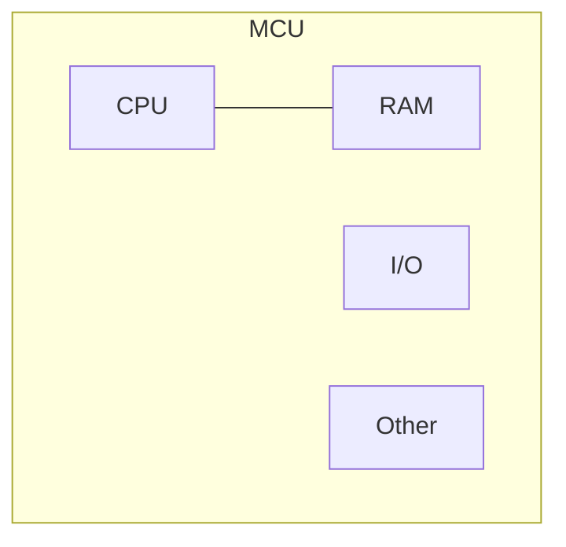
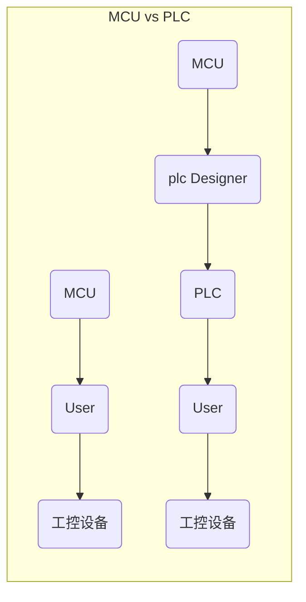

#MCU与其他芯片对比

CPU、MCU、PLC、DSP、SOC、FPGA等之间的关系

##CPU

Central Processing Unit

即独立的CPU芯片，包括运算器和控制器。扩展部分在CPU外部实现，例如RAM、I/O口等都在外部，扩展非常灵活，但体积会较大。

由于CPU是独立的，所以性能很强劲。

## MCU

Micro Controller Unit，也被称为Single Chip Microcomputer，直译为“单片微型计算机”。整个MCU芯片就是一个微型计算机，MCU是芯片级的计算机，或者说一个芯片就是一个计算机

MCU芯片内部处理除了CPU以外，还包含了很多其他东西
- RAM
- ROM
- 定时器
- 串口
- 模数转换
- DMA
- 等

*MCU有效的解决了体积问题，而且价格低，使用方便，被应用在大量的电子设备上*

MCU分类

- 低端：8051
- 中端：stm32
- 高端：ARM中A系列(Cortex-A8，Cortex-A9等)

## PLC

Programmable Logic Controller

PLC并不是一个芯片，而是一个设备，用于工业控制

MCU用于工业控制时，面临的问题
- 开发周期长
- 稳定性不高
- 设计难度大
- 成本高

由专业的MCU设计公司开发出来的半成品工控设备就是PLC

>经验丰富的、专业的、熟悉工控设备开发的MCU设计者站出来，使用MCU从零设计了一款稳定性极高的、可图形化编程的、具备基础功能的半成品工控设备，这个半成品MCU工控设备就是PLC，其它工控开发公司拿到这个稳定成熟的半成品设备后，非常容易的就能扩展出自己特有的、而且还是高性能的工控设备。

PLC的优点

- 无需从零开发、功能扩展非常容易
- 编程容易，使用梯形图编程
- 稳定程度高，针对工业环境设计

PLC的缺点

- 各厂家硬件、编程系统不兼容
- 不同厂家的PLC的编程方式（梯形图）不同，MCU都可以用C语言开发
- PLC价格昂贵，不适合民用设备开发

## SOC

System-on-a-chip

**MCU**

MUC是**通用**计算机芯片，既能用于家电，也能工业、交通等很多方向
- 程序有开发公司自己编写
- MCU会集成各种常见外设

遇到的问题
- 产品只用到MCU中某几个外设，其他没用
- 开发的程序多是雷同的

**SOC**

SOC相当于是拥有特定用途的，为了节省成本而在出厂时固化了代码、且只集成专用外设、而且使用量非常巨大的特殊MCU

- 将MCU中不需要用到外部设备裁剪掉，比如我只需要网卡，那么我就只留下网卡，为购买MCU的公司节省了成本			
- MCU生产厂家直接将程序固化在芯片内，购买到MCU的公司就不用自己写程序了，也节省了成本

## DSP

Digital Signal Process

专门进行大量数据运算的专用芯片，比如音视频编解码、3D渲染等

为了不让CPU陷入大量的运算之中，而是负责整个计算机大局上各部件、各种程序的正常运转，从而产生了DSP，CPU给DSP划分任务。主要就是为了解放CPU。

CPU和DSP可以集成在一起，也可以是独立的两个芯片

## FPGA

Field－Programmable Gate Array，直译为“现场可编程逻辑门阵列”

这些“逻辑门”在出厂时没有固定死的连接在一起，芯片是半成品，可以按照自己的需求通过硬件编程语言，把这些门电路像搭积木似的进行按需组合连接。由于编程修改的是芯片内的门电路组合关系，也就是硬件组合关系，因此FPGA的编程也称为硬件编程。

>FPGA的硬件编程所使用的语言叫HDL（Very-High-Speed Integrated Circuit Hardware Description Language），简称为“硬件描述语言”，该语言编写的程序可以直接修改FPGA芯片内部的门电路组成结构，也就是修改内部的硬件结构。

FPGA的优点

- 定制门电路关系，效率非常高
- 硬件就把功能定制好了，不用在用C或汇编编程了

缺点

- PLC价格昂贵
- 开发难度大

## 其他知识点

- 片外外设
- 片内外设
