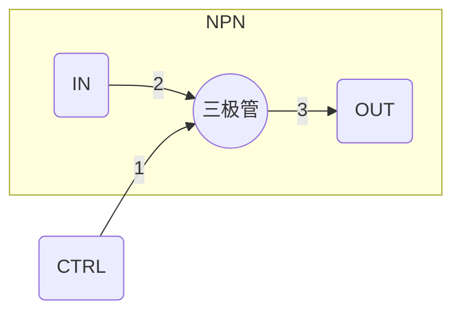
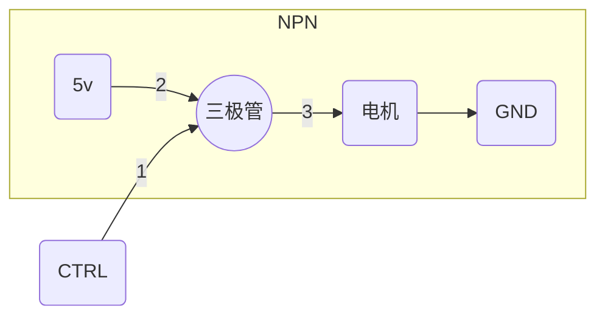
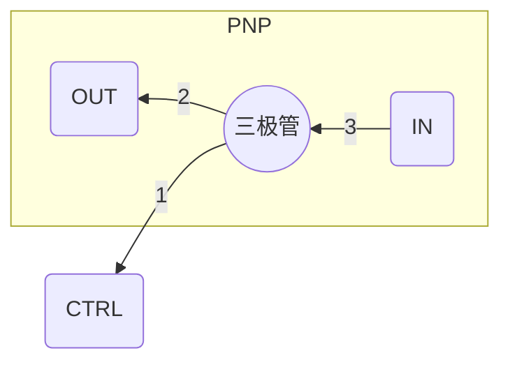
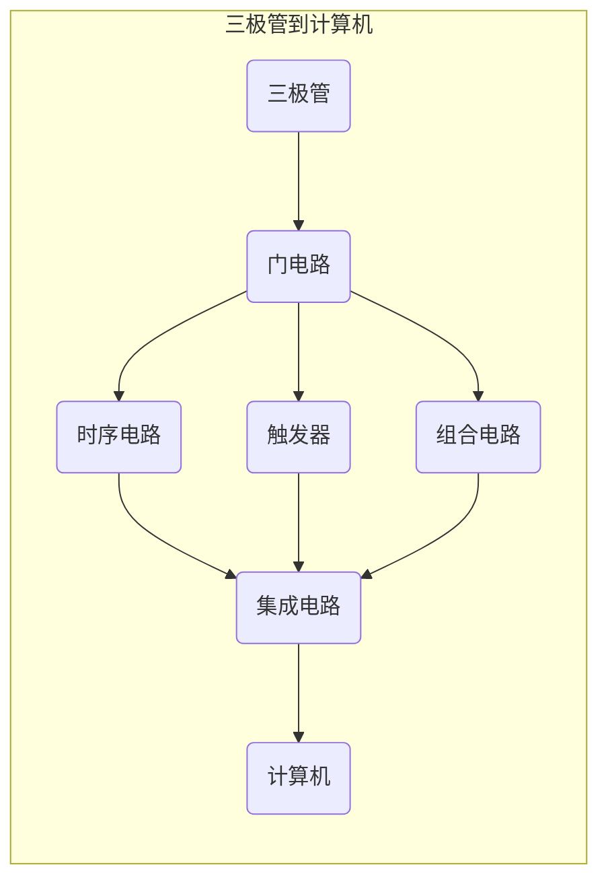

# 三极管

## 三极管的三种特性

**截止**
1端电压小于0.7v，三极管截止，2端与3端之间是断开状态

**放大**
1端电压大于0.7v，三极管导通，2端与3端之间为导通状态，并且随着1端电压的增加，2端与3端之间的电流增大

**饱和**
1端电压增加到一定程度，三极管进入饱和状态，1端电压继续增加，2,3端之间的电流也不会增加

## 使用案例

**电流放大功能**

控制电机转速

调整控制电流，调整电机转速。

**开关功能**

常用于实现数字电路，控制输出高低电平

## 三极管分类

两种三极管极性不同
- NPN
- PNP

三极管三个电极的名称

- 1端：基级（B）
- 2端：集电极（C）
- 3端：发射极（E）

## 从三极管到计算机

