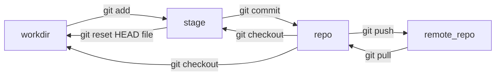

# Repository

Drawing

```mermaid
graph LR
  workdir --git add--> stage
  stage --git reset HEAD file--> workdir
  stage --git commit--> repo
  repo --git checkout --> stage
  repo --git push--> remote_repo
  remote_repo --git pull--> repo
  repo --git checkout--> workdir
```
