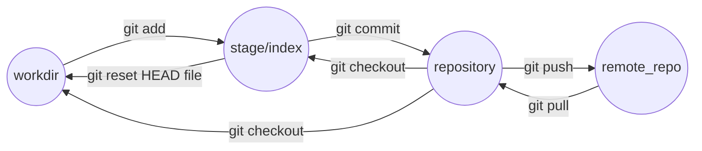

# Repository

Drawing

```mermaid
graph LR
  A((workdir)) --git add--> B((stage/index))
  B --git reset HEAD file--> A
  B --git commit--> C((repository))
  C --git checkout --> B
  C --git push--> D((remote_repo))
  D --git pull--> C
  C --git checkout--> A
```
