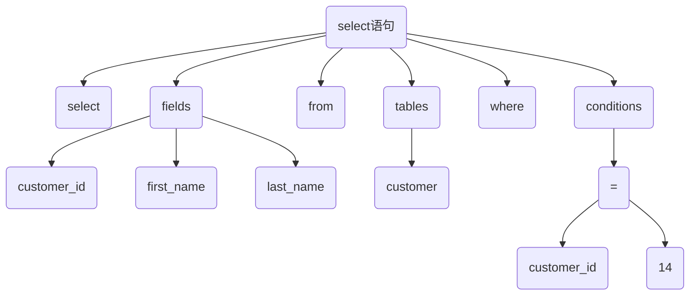

# SELECT语句执行流程

客户端 > 连接器 > 查询缓存 > 解析器和预处理 > 优化器 > 执行器 > 存储引擎 > 磁盘

## MySQL分层

大体来说，MySQL 可以分为 Server 层和存储引擎层两部分。

**Server 层**

所有跨存储引擎的功能都在这一层实现，都在这一层。包括连接器、查询缓存、分
析器、优化器、执行器等，涵盖 MySQL 的大多数核心服务功能，所有跨存储引擎的功能都在这一
层实现。


**存储引擎层**

负责数据的 **存储** 和 **提取**。其架构模式是插件式的，支持 InnoDB、MyISAM、Memory
等多个存储引擎。现在最常用的存储引擎是 InnoDB，它从 MySQL 5.5.5 版本开始成为了默认存
储引擎。

## 连接器

连接器负责和客户 **端建立连接**、**获取权限**、**维持和管理连接**

*相当于公司前台*

**认证**

客户端和服务完成TCP三次握手之后，连接器开始认证身份，提示密码

- 如果用户名和密码不对，Access denied
- 如果用户名和密码通过，连接器会到权限表里查看该用户的权限，
  之后，这个连接里面的权限判断逻辑，都依赖于此时读到的权限

**查看连接**

```
[root@localhost][(none)]> show processlist;
+----+------+-----------+------+---------+------+----------+------------------+-----------+---------------+
| Id | User | Host      | db   | Command | Time | State    | Info             | Rows_sent | Rows_examined |
+----+------+-----------+------+---------+------+----------+------------------+-----------+---------------+
|  4 | root | localhost | NULL | Query   |    0 | starting | show processlist |         0 |             0 |
+----+------+-----------+------+---------+------+----------+------------------+-----------+---------------+
1 row in set (0.00 sec)

```

**短连接**

每次查询建立一个连接，执行完一系列增删改查操作后，主动断开连接。

**长连接**

连接成功后，客户端所有请求使用同一个连接。如果客户端太长时间没有操作，服务器自动将它断开
超时时间由`wait_timeout`参数控制

长连接可能会导致mysql内存占用过大，如果OOM了，mysql进程可能会被系统杀掉

- 可以在程序里面定期断开长连接
- mysql 5.7可以执行`mysql_reset_connection`来初始化连接资源
  连接恢复到最初建立完成的状态

## 查询缓存

缓存命中，直接返回查询结果，不继续走后面的查询步骤了
mysql 默认查询缓存是关闭的


**不建议启用查询缓存**

- SQL语句完全相同才会命中缓存
- 缓存失效非常频繁，只要表结构有改动或表中数据发生更新，与这个表有关的查询缓存就会被清空

*mysql 8 已经废弃了查询缓存功能*

## 解析器

parser

**词法分析**

将SQL语句切割成一个个的字符串（token）

```
select customer_id,first_name,last_name from customer where customer_id=14;
```

to

```
select，customer_id,first_name,last_name，from，customer，where，customer_id，=，14

```

**语法分析**

判断语法是否正确，构建解析树。语句敲错了，会提示“You have an error in your SQL syntax”

解析树



## 预处理器

- 预处理器则会进一步去检查解析树是否合法，比如表名是否存在，语句中表的列是否存在等等
- 在这一步MySQL会检验用户是否有表的操作权限
- 预处理之后会得到一个新的解析树

## 优化器

一条SQL语句有多种执行方式，优化器要选择出最优的去执行

查询优化器的作用就是根据解析树生成不同的执行计划，然后选择一种最优的 **执行计划**，MySQL 里面使
用的是基于成本模型的优化器，哪种执行计划执行时成本最小就用哪种。

1. 当有多个索引可用的时候，决定使用哪个索引
2. 在一个语句有多表关联（join）的时候，决定各个表的连接顺序，以哪个表为基准表

```
#查看上次查询成本
[root@localhost][test1]> show status like 'Last_query_cost';
+-----------------+----------+
| Variable_name   | Value    |
+-----------------+----------+
| Last_query_cost | 1.199000 |
+-----------------+----------+
1 row in set (0.00 sec)
```

**关键点**：索引

## 执行器

1. 判断对表是否查询的权限。如果没有，返回没有权限的错误。
2. 如果有权限，就使用指定的存储引擎打开表开始查询

执行器会根据表的引擎定义，去使用这个引擎提供的查询接口，提取数据


## 磁盘
磁头、磁道、扇区（512字节）

- 顺序写
- 随机写

脏页落盘

预写日志（WAL）
