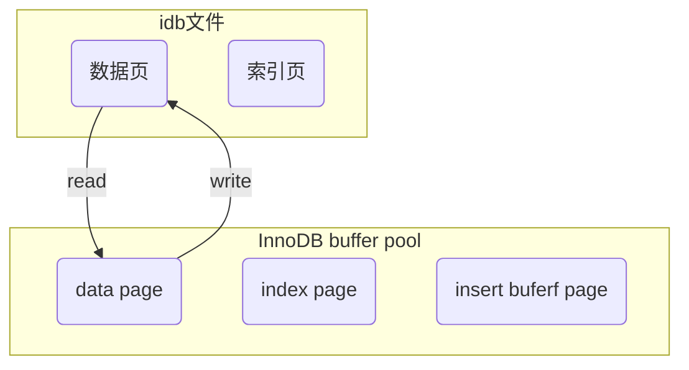
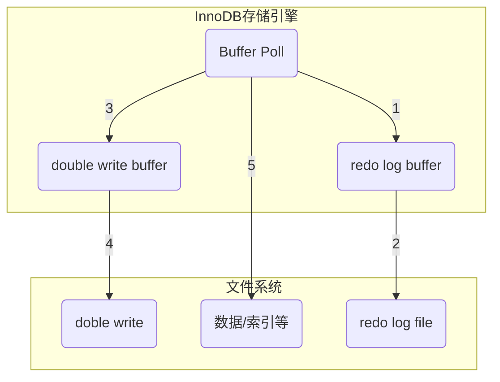
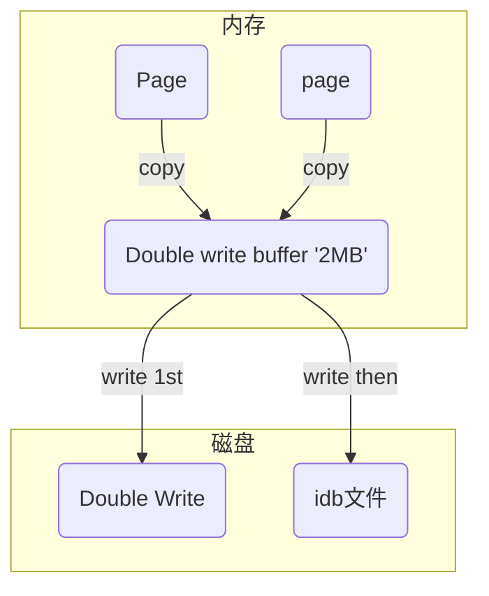

# InnoDB数据写流程

## 概览

InnoDB存储引擎与磁盘的交互

**InnoDB buff pool**

- data page
- index page
- insert buffer page
- adaptive hash index
- lock info
- data dictionary

## 写流程

**原理**：

1. 每次commit，先写入redo log文件，此时脏页不落盘，等到执行checkpoint时，才落盘
2. 如果执行checkpoint之前，数据库宕机，可以根据redo log进行恢复
3. redo log保存的是上次checkpoint之后，未落盘的数据记录

redo log buffer默认8MB，控制参数：`innodb_log_buffer_size`

其他机制

- Force log at commit
- Double write

**redo log**

redo log其实是记录了，已经commit但是没有经过checkpoint落盘的数据

一旦数据库宕机，没有落盘的数据，还可以从redo log恢复

redo log默认有2个文件，循环使用

**checkpoint**

执行checkpoint时，进行脏页落盘，落盘时机：

- 当buffer pool不够用时，根据LRU算法会溢出最近最少使用的页，若此页为脏页，那么需要强制执行
Checkpoint，将脏页也就是页的新版本刷回磁盘
- redo log file没有空间时，强制执行checkpoint。数据落盘了，redo log就可以释放了

**Force log at commit**

事务一旦提交，立即将redo log写入磁盘，参数：`innodb_flush_log_at_trx_commit` 取值为1

**double write**

在对缓冲池的脏页进行刷新时，并不直接写磁盘，而是通过memcpy函数将脏页先复制到内存中的double write buffer区域，之后通过double write buffer再分两次，每次1MB顺序地写入共享表空间的物理磁盘上，然后马上调用fsync函数，同步磁盘，避免操作系统缓冲写带来的问题。

在完成double write页的写入后，再将double wirite buffer中的页写入各个表空间文件中。

如果操作系统在将页写入磁盘的过程中发生了崩溃，在恢复过程中，InnoDB存储引擎可以从共享表空间中的double write中找到该页的一个副本，将其复制到表空间文件中，再应用重做日志。
