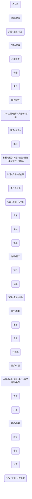

# 高考专业

**专业**

```mermaid
graph LR
  1(农林牧)
  2(地质+勘察)
  3(采油+采煤+采矿)
  4(气象+环保)
  5(环境保护)
  6(安全)
  9(电力)
  10(风电+光电)
  11(材料:金属+无机+高分子+成型)
  12(建筑+工程+)
  13(水利)
  14(机械+数控+铸造+锻造+模具+工业设计+内燃机)
  15(制冷+光电+新能源)
  16(电气自动化)
  17(铁路+船舶+飞行器)
  18(汽车)
  19(食品)
  20(化工)
  21(纺织+轻工)
  22(制药)
  23(轨道)
  24(交通+运输+桥梁)
  25(航空+机场)
  26(电子)
  27(通信)
  28(计算机)
  29(医学+中医)
  30(金融+财务+保险+会计+电子商务+物流)
  31(旅游)
  32(文艺)
  33(新闻+影视)
  34(教育)
  35(语言)
  36(体育)
  37(公安+法律+公共事业)
```
