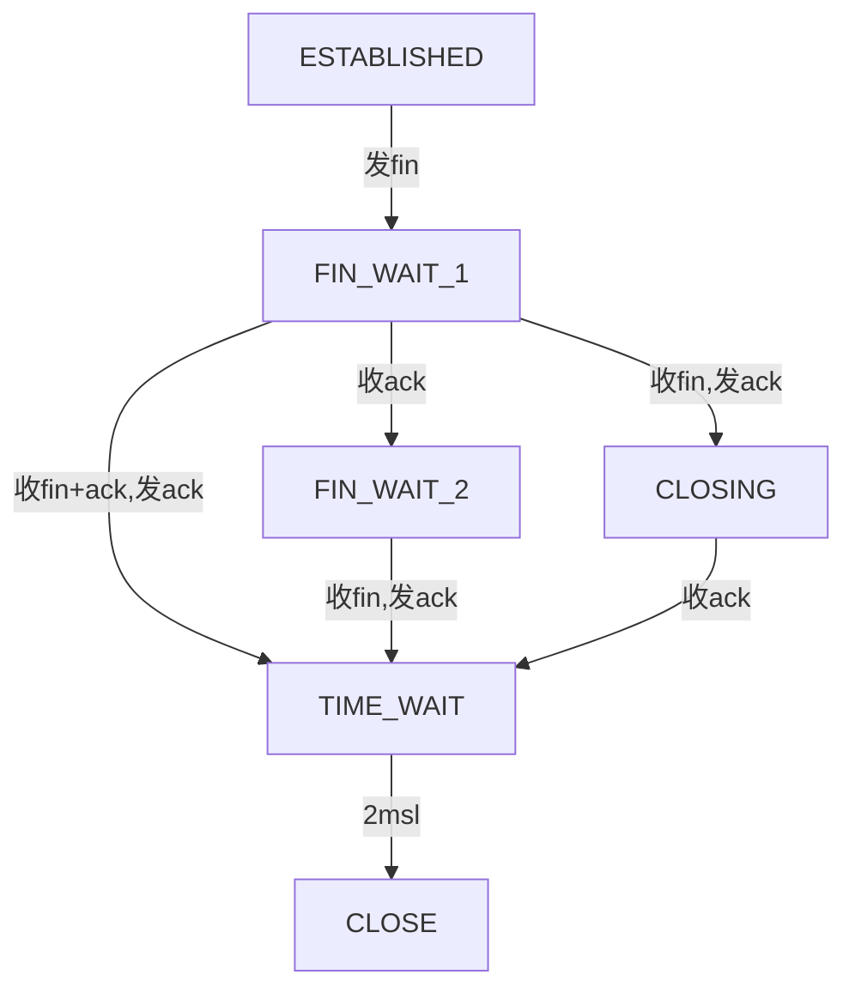
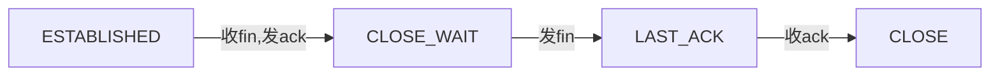

# TCP 状态机

将tcp状态机分解成4张图
- 打开状态，即由`CLOSE`迁移至`ESTABLISHED`，打开状态又分为
  - 主动打开
  - 被动打开
- 关闭状态，即由`ESTABLISHED`迁移至`CLOSE`，关闭状态又分为
  - 主动关闭
  - 被动关闭

## 被动打开

**服务端**

## 主动打开

**客户端**

## 主动关闭

## 被动关闭

